# 5. UI/UX DESIGN

This chapter presents the user interface and user experience design of Sentry AI. The design reflects careful consideration of color psychology, visual hierarchy, and user-centered principles specifically tailored for a mental health and productivity application. A total of 30 screens were designed across seven functional areas, creating a cohesive and calming experience that supports users in managing their well-being.

---

## 5.1 Design Philosophy

### 5.1.1 The Importance of UI/UX in Mental Health Applications

User interface design in mental health applications carries responsibilities beyond typical software. Users interacting with Sentry AI may already be experiencing stress, exhaustion, or emotional overwhelm. A poorly designed interface—cluttered layouts, harsh colors, confusing navigation—can amplify these negative states and discourage continued use.

Conversely, thoughtful design actively supports the application's therapeutic goals. A calming color palette reduces anxiety. Clear visual hierarchy minimizes cognitive load. Intuitive navigation prevents frustration. Encouraging illustrations and friendly language motivate positive behavior change without creating pressure.

Research in digital therapeutics demonstrates that user engagement with mental health applications drops significantly when the interface feels clinical, complicated, or visually unappealing. Users must feel that the application is a supportive companion, not another source of stress competing for their attention.

For Sentry AI specifically, the interface communicates:
- **Trust** — Users share sensitive information about their workload and emotional state
- **Calm** — The visual experience feels peaceful, not overwhelming
- **Clarity** — Information is immediately understandable at a glance
- **Motivation** — Design encourages positive action without pressure
- **Warmth** — Friendly illustrations create an approachable, human feel

### 5.1.2 Design Principles

**Simplicity Over Complexity**

Every screen focuses on a single primary purpose. The home dashboard shows the day's plan at a glance. The burnout screen focuses on the score and its components. Secondary features remain accessible but visually subordinate. White space and soft backgrounds let content breathe.

**Progressive Disclosure**

Information is revealed gradually as users need it. The dashboard shows summary metrics; detailed breakdowns appear on dedicated screens. Recommendations show headlines first; action steps expand on demand. This approach prevents information overload while keeping depth accessible.

**Encouraging Without Pressuring**

The application uses friendly language and supportive illustrations. Instead of alarming warnings, the interface uses gentle color transitions (green to yellow to red) to indicate status. Success is celebrated; challenges are addressed with support rather than criticism. The AI companion asks "wanna say something?" rather than demanding input.

**Consistency Across Flows**

The design system ensures visual consistency throughout the application. Cards use the same rounded corners and gradient styles. Typography follows a clear hierarchy. The bottom navigation provides constant orientation. Users always know where they are and how to navigate.

---

## 5.2 Color Psychology and Palette Selection

### 5.2.1 The Psychology of Color in Wellness Applications

Color profoundly influences emotional state and behavior. The Sentry AI color palette was carefully selected based on established research in color psychology, prioritizing calming tones that reduce anxiety while maintaining visual interest and clarity.

**Light Blue — Calm and Serenity**

Light blue serves as the dominant background color throughout the application. Blue is universally associated with calm, trust, and stability. It lowers heart rate and reduces anxiety. The soft, light blue (#E8F4FC) creates a serene atmosphere that feels like a clear sky—open, peaceful, and refreshing. This choice directly supports users who may be experiencing stress.

**Teal/Cyan Gradients — Energy and Freshness**

Cards and interactive elements use teal-to-cyan gradients (#4ECDC4 to #44A8B3). These colors combine the calming properties of blue with the vitality of green, creating a sense of balanced energy. The gradients add visual depth and modern appeal while maintaining the overall calming aesthetic.

**White and Light Tones — Clarity and Space**

White cards and light backgrounds create visual breathing room. In a mental health application, avoiding visual clutter is essential. The generous use of light tones ensures content stands out clearly without overwhelming the user.

**Status Colors — Intuitive Communication**

The burnout gauge uses an intuitive traffic-light metaphor:
- **Green** — Healthy, low burnout risk
- **Yellow** — Moderate, attention needed
- **Red** — Critical, immediate action required

This familiar color coding communicates status instantly without requiring users to read numbers or labels.

**Accent Colors — Visual Interest**

Purple and pink gradients appear in recommendation cards, adding warmth and visual variety. These colors are associated with creativity and care, appropriate for sections offering personalized guidance.

### 5.2.2 The Sentry AI Color Palette

**Primary Colors**

| Color | Usage |
|-------|-------|
| Light Blue (#E8F4FC) | Primary background throughout the app |
| Teal (#4ECDC4) | Card backgrounds, interactive elements |
| Cyan (#44A8B3) | Gradient endpoints, accents |
| Deep Blue (#1E88E5) | Primary buttons, links |

**Status Colors**

| Color | Usage |
|-------|-------|
| Green (#4CAF50) | Healthy status, success, completion |
| Yellow/Amber (#FFC107) | Moderate status, attention needed |
| Red (#F44336) | Critical status, urgent items |

**Accent Colors**

| Color | Usage |
|-------|-------|
| Purple gradient | Recommendation cards |
| Pink/Coral | Secondary highlights |
| White (#FFFFFF) | Cards, input fields |

### 5.2.3 Light Theme Rationale

Unlike many productivity apps that use dark themes, Sentry AI uses a light, airy color scheme for important psychological reasons:

**Openness and Hope**

Light colors create a sense of openness and possibility. For users experiencing burnout—which often involves feelings of being trapped or overwhelmed—a bright, open interface subconsciously communicates that relief is possible.

**Daytime Optimization**

Users primarily interact with the app during work hours when light themes are more comfortable and match ambient lighting conditions.

**Approachability**

Light interfaces feel friendlier and less technical. The soft blue background resembles a calm sky, creating an inviting atmosphere rather than a clinical tool.

**Illustration Integration**

The friendly character illustrations integrate seamlessly with the light background, creating a cohesive, storybook-like quality that makes the app feel personal and supportive.

---

## 5.3 Visual Elements and Illustrations

### 5.3.1 Character Illustrations

A distinctive feature of Sentry AI's design is the consistent use of friendly character illustrations throughout the application. These illustrations serve multiple purposes:

**Humanizing the Experience**

The illustrated characters—depicting people working, thinking, and interacting with technology—make the app feel personal rather than clinical. Users see relatable representations of themselves.

**Emotional Communication**

Illustrations communicate emotional states that support the app's messaging. The onboarding illustration shows a person overwhelmed with papers and devices, validating the user's feelings. Later illustrations show calm, organized scenarios, suggesting the positive outcomes the app enables.

**Visual Storytelling**

Each major section uses illustrations that tell a story:
- Onboarding: Overwhelmed person → AI assistant helping → Organized, peaceful work
- Login: Person at desk with security elements, suggesting safe, protected access
- AI Companion: Friendly robot offering to help

**Consistent Style**

All illustrations share a consistent style:
- Flat design with subtle gradients
- Blue-dominant color scheme matching the app palette
- Friendly, rounded character designs
- Modern, professional aesthetic

### 5.3.2 The AI Companion Character

The AI companion is represented by a distinctive robot character with:
- Rounded, friendly form (not angular or threatening)
- Teal/cyan coloring matching the app palette
- Headphones suggesting it's ready to listen
- Expressive posture (waving, gesturing helpfully)

This character appears on the home screen with the prompt "wanna say something?" creating an inviting entry point for emotional support. The friendly design encourages users to share their feelings without judgment.

### 5.3.3 Iconography

Icons throughout the app follow a consistent style:
- Rounded, soft appearance
- Consistent stroke weight
- Clear metaphors (calendar for schedule, chart for analytics)
- Matching the overall friendly aesthetic

The bottom navigation uses filled icons for the active state and outlined icons for inactive states, providing clear visual feedback.

---

## 5.4 Navigation and Information Architecture

### 5.4.1 App Flow Structure

The application follows a hub-and-spoke model with the Home screen as the central navigation point. The wireframe diagrams reveal the complete flow architecture:

**Flow 1: Onboarding + Login**
Onboarding screens → Email Verification → Login/Signup → Profile Setup Questions → Home

**Flow 2: Main Application**
Home connects to all major sections:
- Tasks (My Tasks → Upload Tasks)
- Profile (Settings → Personal Data → Contact Info)
- Burnout (Score → Details → Recommendations)
- AI Companion (Chat interface)
- Notebook Library (Create → Chat → AI Studio)
- Integrations (Connected services)

### 5.4.2 Bottom Navigation

The primary navigation uses a bottom tab bar with five sections:

1. **Integrations** (link icon) — Third-party service connections
2. **Analytics** (chart icon) — Burnout analysis and trends
3. **Home** (house icon) — Central dashboard
4. **Calendar** (calendar icon) — Task and schedule view
5. **Notebook** (book icon) — Notebook library

The home icon is centrally positioned and slightly elevated, emphasizing its role as the primary hub. This pattern is familiar to mobile users and enables one-handed navigation.

### 5.4.3 Screen Flow Principles

**Minimal Depth**

Most features are accessible within 2-3 taps from the home screen. Users can check their burnout score, view recommendations, or chat with the AI companion without navigating through complex hierarchies.

**Clear Back Navigation**

All secondary screens include a back arrow in the top-left corner, following platform conventions. Users always have a clear escape route.

**Contextual Actions**

Actions appear where users need them. The "Add a source" button appears directly in the notebook library. The "Apply All" button appears at the top of recommendations. Users don't need to hunt for functionality.

---

## 5.5 Screen Designs by Service

This section presents each screen's role within the user journey, explaining why each design decision supports the application's goals of reducing burnout and encouraging sustainable well-being.

---

### 5.5.1 Onboarding Flow

The onboarding experience serves a critical psychological function: it must validate the user's struggles while building confidence that the app can help. Users downloading a burnout app are often already stressed—the onboarding must not add to that burden.

---

#### Figure 5.1: Onboarding Screen 1 — "Take it easy"

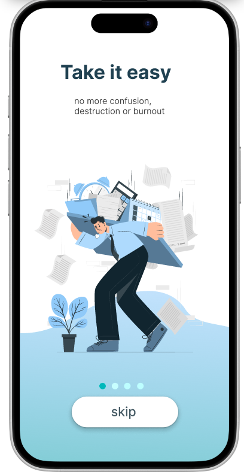

**Purpose:**

The first screen sets the emotional tone for the entire relationship with the app. Rather than immediately showcasing features, this screen prioritizes empathy and validation of the user's struggles.

**Visual Elements:**

The screen features a large headline and subheadline explaining the app's promise, accompanied by an illustration showing a stressed person surrounded by overwhelming work artifacts. Navigation elements include pagination dots indicating the onboarding sequence length and a skip button for users who want to proceed directly to the app.

**Design Rationale:**

By visually depicting the chaos that burnout sufferers know intimately, the app communicates "we understand what you're going through" before asking anything of the user. The reassuring headline creates immediate relief, while the skip button respects users' time and autonomy—critical for people who already feel overwhelmed.

---

#### Figure 5.2: Onboarding Screen 2 — "Auto scheduling with AI"

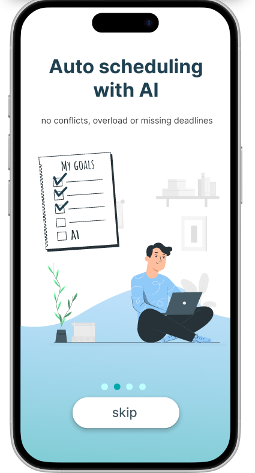

**Purpose:**

Having acknowledged the problem, this screen presents the first pillar of the solution: intelligent task management powered by AI.

**Visual Elements:**

The headline introduces the AI scheduling capability, with a subheadline addressing specific pain points. The illustration shows a relaxed person in a calm home environment with visual indicators of completed tasks. The same navigation pattern continues from the previous screen.

**Design Rationale:**

The visual narrative shifts dramatically from chaos to calm, showing users the outcome they can expect. The promise of eliminating "conflicts, overload or missing deadlines" directly addresses common contributors to burnout. The home environment with plants subtly suggests that this solution enables work-life balance, not just more efficient work.

---

#### Figure 5.3: Onboarding Screen 3 — "Speak with your assistant"

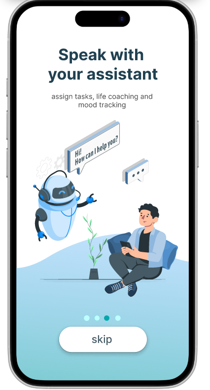

**Purpose:**

The final onboarding screen introduces what differentiates Sentry AI from typical productivity apps: the AI companion for emotional support.

**Visual Elements:**

The screen presents a headline and feature description, accompanied by an illustration of the AI robot character initiating conversation with the user. The robot design is friendly and approachable, wearing headphones to symbolize listening.

**Design Rationale:**

This screen establishes that the app cares about how users feel, not just what they accomplish. The friendly robot character becomes a familiar presence throughout the app, signaling that this is a safe space for emotional expression. The conversational framing emphasizes dialogue rather than data entry.

---

### 5.5.2 Authentication Flow

Authentication screens handle sensitive personal data—burnout status, emotional states, work struggles. The design must build trust while minimizing friction. Every additional step risks losing users who are already low on energy and patience.

---

#### Figure 5.4: Sign Up Screen

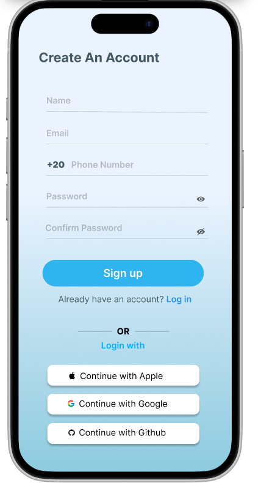

**Purpose:**

New user registration is a critical conversion point where the app must minimize barriers while collecting necessary information for personalization.

**Visual Elements:**

The screen presents a clean registration form with input fields for essential user information, a primary signup button, and alternative authentication options through social login providers. Visual dividers separate the traditional registration path from social authentication.

**Design Rationale:**

The design provides multiple registration pathways to accommodate different user preferences. Social authentication buttons are prominently displayed because they significantly reduce abandonment rates by eliminating the need to create and remember another password. The form requests only essential information upfront, keeping it compact rather than overwhelming users who are already stressed.

---

#### Figure 5.5: Login Screen

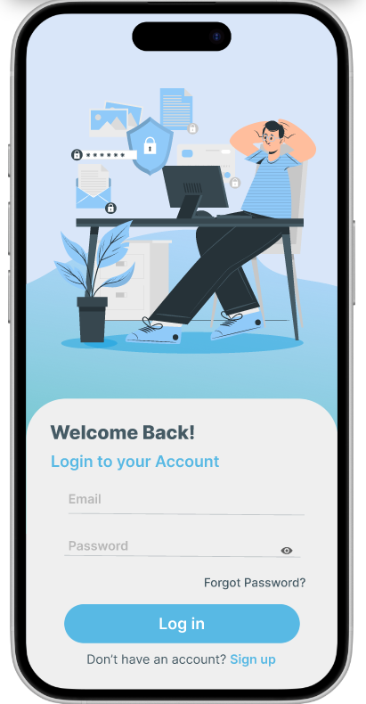

**Purpose:**

The login screen welcomes returning users back to the app while ensuring secure authentication.

**Visual Elements:**

The screen features a welcoming header with personalized greeting, credential input fields with a password visibility toggle, a forgot password recovery link, and a primary login button. An illustration reinforces security and trust.

**Design Rationale:**

The greeting personalizes what could be a purely transactional interaction, reinforcing the user's decision to return. Security iconography in the illustration reassures users about data protection without requiring conscious thought about security. The password visibility toggle prevents frustration from failed login attempts by allowing users to verify their input.

---

#### Figure 5.6: Forgot Password Screen

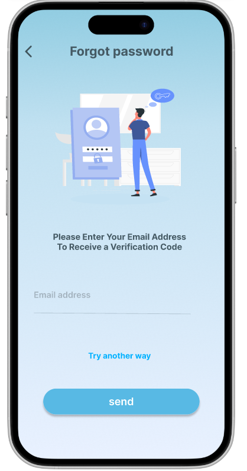

**Purpose:**

Initiate the password recovery process in a way that reduces user frustration and anxiety.

**Visual Elements:**

The screen includes clear instructional text, an email input field, alternative recovery options, and a submit button. An illustration visualizes the verification process that will follow.

**Design Rationale:**

Password recovery is inherently frustrating. The design acknowledges this by providing clear guidance and alternative pathways. The illustration reduces anxiety by showing users what to expect next in the process.

---

#### Figure 5.7: Create New Password Screen

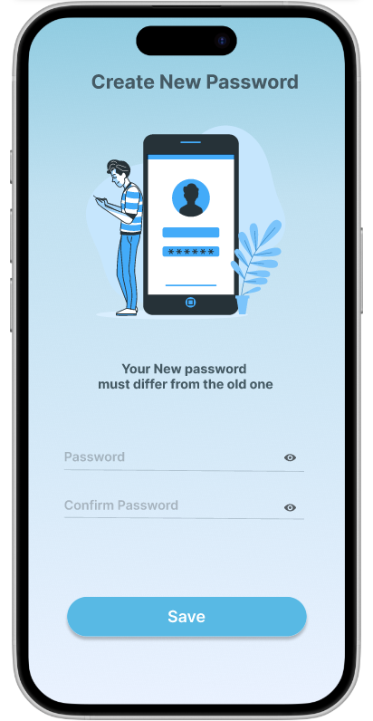

**Purpose:**

Allow users to set a new secure password after verification.

**Visual Elements:**

The screen contains password input fields with confirmation, helpful security guidance text, and a save button.  The illustration maintains visual continuity with the previous recovery screen.

**Design Rationale:**

Clear guidance prevents users from reusing compromised passwords, improving security without adding friction. Visual continuity reassures users they're still in the recovery flow.

---

#### Figure 5.8: Email Verification Screen

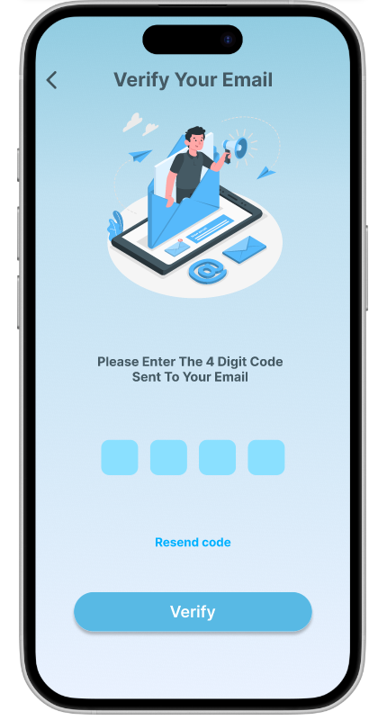

**Purpose:**

Verify email ownership through a secure code sent to the user's inbox.

**Visual Elements:**

The screen presents instructional text, separate input boxes for each verification code digit, a resend option, and a verify button. An illustration communicates the notification concept.

**Design Rationale:**

Separate digit boxes significantly improve input accuracy compared to a single text field while providing clear visual feedback about code length. The resend option addresses the common user anxiety about email delivery without requiring backward navigation.

---

### 5.5.3 Profile Setup Screen

---

#### Figure 5.9: Profile Questions Screen

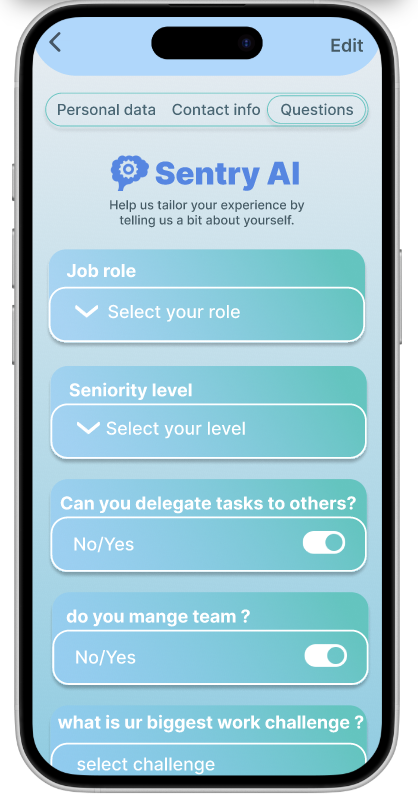

**Purpose:**

This screen completes the user profile by gathering work-context information that directly influences burnout analysis and recommendation personalization. Unlike the previous tabs focused on identity, this collects situational data about the user's role, responsibilities, and constraints.

**Visual Elements:**

The screen presents a tabbed interface with "Questions" as the active tab, showing the Sentry AI branding and personalization message at the top. The form contains a mix of dropdown selectors for role-based questions and toggle switches for binary choices about delegation capabilities and team management. An edit button enables later modifications.

**Design Rationale:**

The questions are specifically designed to affect recommendation logic—a user who cannot delegate tasks shouldn't receive delegation-focused advice. Toggle switches make yes/no questions frictionless. Dropdown menus structure complex choices like roles and seniority levels. By collecting this data upfront, the app avoids recommending impossible or irrelevant strategies later.

---

### 5.5.4 Home Dashboard

---

#### Figure 5.10: Home Screen

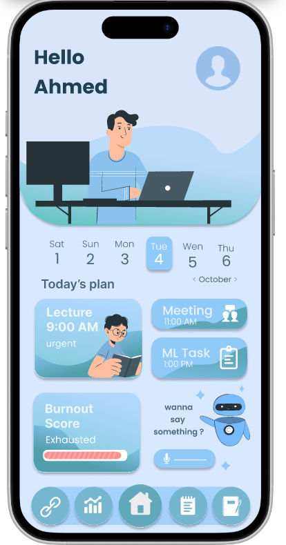

**Purpose:**

The home screen serves as the user's daily command center, providing immediate awareness of the most important information: today's schedule, burnout status, and access to emotional support. This is where users start every session.

**Visual Elements:**

The screen opens with a personalized greeting and avatar alongside an encouraging illustration. A horizontal calendar strip enables quick date navigation with the current day visually highlighted. The main content area displays task cards with gradient backgrounds and urgency indicators, followed by status cards showing burnout level with a visual gauge and the AI companion invitation. The standard bottom navigation bar anchors the screen.

**Design Rationale:**

The dashboard follows a "glanceable" design philosophy where users absorb critical information in seconds. The vertical arrangement prioritizes information by importance: greeting (emotional connection), calendar (temporal orientation), tasks (immediate actions), burnout status (self-awareness), and companion access (support). The burnout score card is deliberately friendly—"Exhausted" with a progress bar creates urgency without triggering additional anxiety. The AI companion's casual "wanna say something?" lowers the barrier to seeking help.

---

### 5.5.5 Burnout Analysis Screens

---

#### Figure 5.11: Burnout Score Screen

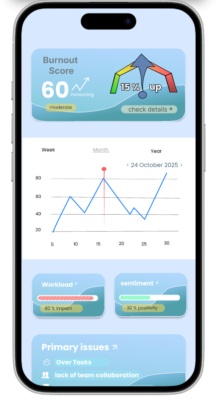

**Purpose:**

This screen transforms abstract burnout indicators into clear, actionable data. Users come here to understand not just how burned out they are, but why—and whether their situation is improving or worsening over time.

**Visual Elements:**

The screen is dominated by a large numerical burnout score accompanied by a trend indicator and status badge. A colorful visual gauge provides quick interpretation of the score's severity. Below this, an interactive line graph shows score evolution over time with period selectors for different time ranges. Two factor cards display the major contributors to burnout with percentage impacts and visual gauges. A primary issues section lists specific detected problems with icons.

**Design Rationale:**

The large numerical score immediately answers the user's primary question: "How burned out am I right now?" The trend arrow and percentage change answer the critical follow-up: "Is it getting better or worse?" The historical graph provides context—a user who sees a spike can correlate it with specific events. Factor cards shift focus from symptoms to causes: "It's not just stress—80% comes from workload." Primary issues begin translating data into action by identifying specific problems to address. The "check details" link promises deeper analysis for users who want to investigate further.

---

#### Figure 5.12: Burnout Details Screen (Scrolled)

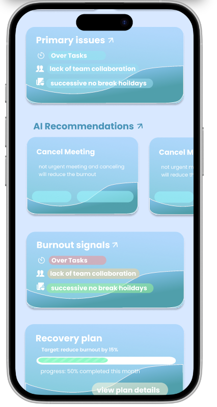

**Purpose:**

This scrolled view reveals the full depth of analysis available to users who want to understand their burnout comprehensively. It bridges the gap between diagnosis (the score) and treatment (the recommendations).

**Visual Elements:**

The screen continues the primary issues list from the previous view, then introduces an AI recommendations preview section showing recommendation cards with brief descriptions. A burnout signals section displays detected warning signs with color-coded severity indicators. Finally, a recovery plan section shows a defined target, progress percentage with visual bar, and completion metrics for recommended steps.

**Design Rationale:**

The scrolled layout reveals information progressively, preventing overwhelm. The recommendations preview creates a clear call-to-action: "Here's what you can do about this." Color-coded burnout signals use the familiar traffic-light system to communicate urgency—red demands immediate attention, yellow warrants monitoring. The recovery plan section is psychologically crucial: it transforms abstract burnout scores into concrete, achievable goals. Seeing "50% progress, completed 5/10 steps" provides motivation through quantified achievement, suggesting that recovery is not just possible but already underway.

---

#### Figure 5.13: Workload Breakdown Screen

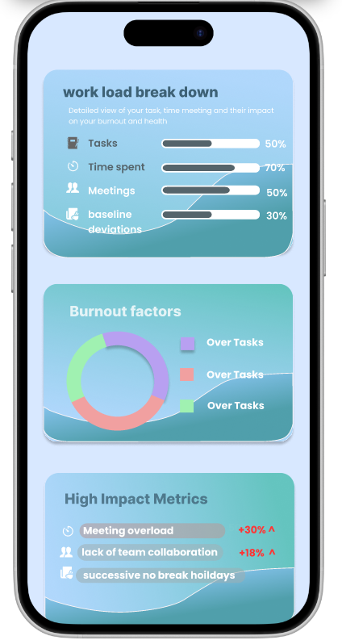

**Purpose:**

For analytically-minded users who want to understand the quantitative drivers of their burnout, this screen provides detailed workload metrics compared against personalized baselines.

**Visual Elements:**

The screen features a horizontal bar chart displaying key workload metrics as percentages exceeding baseline levels. A circular donut chart visualizes the proportional contribution of different burnout factors with color-coded segments and a legend. Below this, a ranked list shows high-impact metrics with percentage change indicators highlighting increases in red.

**Design Rationale:**

Generic advice says "reduce meetings"—but how many meetings are too many for *you*? This screen answers that by comparing current metrics to the user's personal baseline. A user seeing tasks at 80% versus a 30% baseline understands "I have nearly triple my normal workload." The donut chart reveals proportional impact—if meetings represent a tiny slice, canceling them won't help much. The high-impact metrics list with change indicators (+30% meeting overload in red) directs attention to the biggest levers for improvement. This data-driven approach helps users make informed decisions about which interventions to prioritize.

---

#### Figure 5.14: AI Recommendations Screen

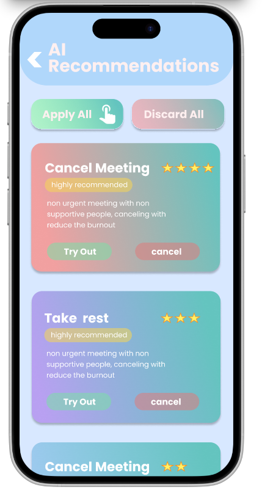

**Purpose:**

This screen transforms burnout analysis into concrete action by presenting personalized, RAG-grounded recommendations that users can immediately apply to their schedule and workload.

**Visual Elements:**

The header contains bulk action buttons for applying or discarding all recommendations at once. The main area displays recommendation cards with gradient backgrounds, each containing a title, star rating indicator, recommendation badge, descriptive text explaining the benefit, and individual action buttons offering low-commitment trial options.

**Design Rationale:**

Every element is designed to reduce the friction of behavioral change. The card-based layout makes each recommendation feel like a single, manageable action rather than an overwhelming list. Star ratings provide algorithmic confidence—"highly recommended" items get priority attention. The "Try Out" button language is psychologically significant: it's experimental, not permanent, lowering the barrier to action. Users experiencing burnout often feel decision-fatigued; the "Apply All" option respects this by enabling batch acceptance. Conversely, "Discard All" acknowledges user autonomy—they can reject suggestions without feeling judged. The gradient backgrounds add visual warmth, preventing the screen from feeling clinical or prescriptive.

---

### 5.5.6 Task Management Screens

---

#### Figure 5.15: My Tasks Screen

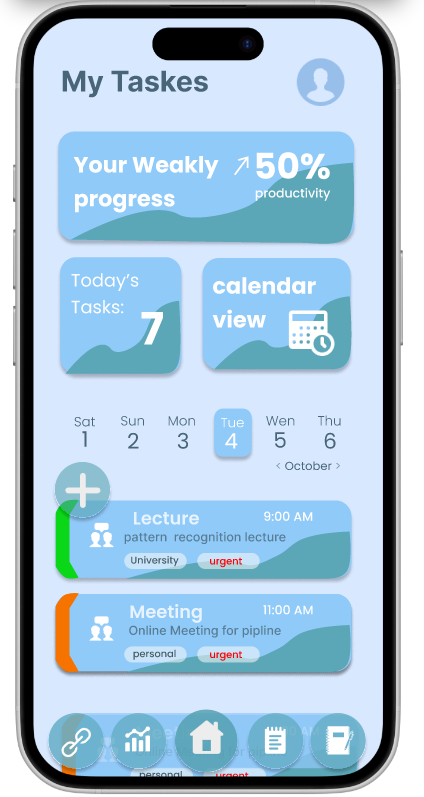

**Purpose:**

The central task management interface where users view, organize, and track their workload. This screen must balance comprehensive task visibility with the need to avoid creating anxiety through information overload.

**Visual Elements:**

The screen opens with a weekly progress card displaying productivity percentage and trend visualization. Summary statistics cards show total tasks and provide access to alternative calendar views. A horizontal calendar strip enables date navigation with the current day highlighted. The main content area presents individual task cards with color-coded priority bars, time information, descriptive text, and category tags. A floating action button enables quick task creation.

**Design Rationale:**

The productivity percentage at the top creates positive reinforcement without pressure—50% is framed as progress, not failure. Color-coded priority bars enable instant visual triage: users scan for orange (urgent) before reading any text. Tags provide context at a glance—"University" distinguishes academic from personal tasks. The floating action button maintains visibility regardless of scroll position, reducing the steps needed to add tasks. By showing time, description, and tags together, each card provides complete information without requiring users to open detailed views for common operations.

---

#### Figure 5.16: Upload Tasks Screen

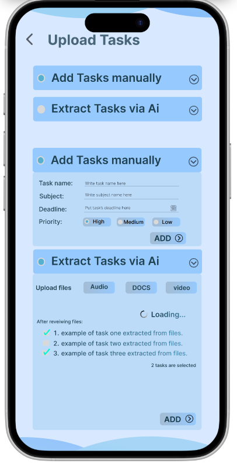

**Purpose:**

This screen dramatically reduces the friction of task entry by offering both traditional manual input and AI-powered extraction from audio recordings, documents, and video—addressing a major pain point for busy users.

**Visual Elements:**

The screen presents two expandable sections for different task addition methods. The manual section displays a traditional form with text inputs for task name and subject, a date picker for deadline selection, and radio buttons for priority levels. The AI extraction section shows file type selectors, a processing indicator, a results preview area with selectable extracted tasks, and a selection counter showing how many tasks will be added.

**Design Rationale:**

The dual-path design acknowledges that task entry contexts vary. Quick thoughts become manual entries; hour-long lecture recordings or meeting notes become AI extractions. The AI extraction preview with checkboxes is critical for trust—users can verify accuracy before committing. This addresses the common concern with AI tools: "What if it gets it wrong?" By showing extracted tasks with individual selection controls, users maintain agency. The loading indicator manages expectations during processing. The selection counter ("2 tasks are selected") provides clear feedback before the final commit action.

---

### 5.5.7 Integration Screens

---

#### Figure 5.17: Integrations Screen

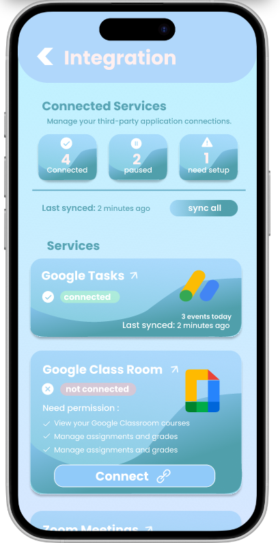

**Purpose:**

Integrations are the bridge between Sentry AI's analysis capabilities and the actual work data that drives burnout. This screen manages connections to external services that automatically populate tasks and calendar events.

**Visual Elements:**

The header displays a summary showing counts of connected, paused, and pending integrations alongside the last synchronization timestamp and a manual sync trigger button. Below this, individual service cards display the service name, connection status badge, relevant metrics or permission requirements, and action buttons. Each service has a distinctive icon for quick recognition.

**Design Rationale:**

The summary at the top provides instant health assessment of all integrations—users immediately see if something needs attention. Status badges use the familiar color coding: green (working), red (needs action), yellow (attention). For connected services, showing recent sync time and event counts builds trust that the integration is actively working. For unconnected services, displaying required permissions upfront sets transparent expectations and prevents abandonment during the OAuth flow. The "sync all" button addresses the common user need to force a refresh when they know changes have occurred externally.

---

#### Figure 5.18: Integrations Screen (Continued)

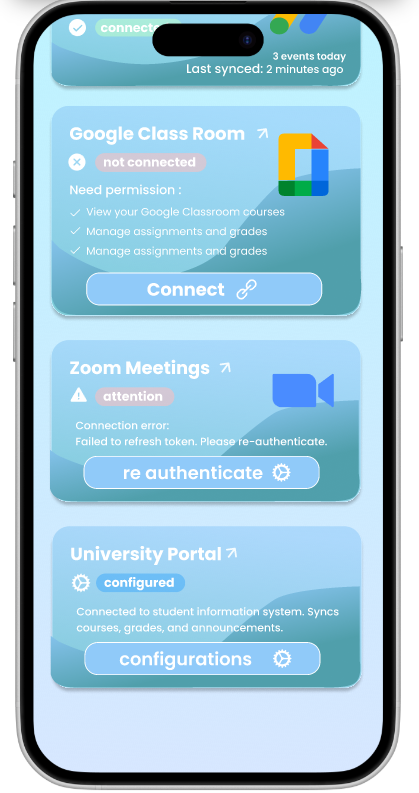

**Purpose:**

The scrolled view reveals additional integrations, including those in error states that require user intervention to restore functionality.

**Visual Elements:**

The continued services list shows additional integration cards including services with attention-required status displaying error messages and re-authentication buttons, as well as successfully configured services showing descriptive summaries of their sync capabilities and configuration access buttons.

**Design Rationale:**

The "attention" status (yellow badge) falls between the urgency of "not connected" and the reassurance of "connected," appropriately signaling that something previously working now needs intervention. The specific error message ("Failed to refresh token") educates users about what happened rather than generic "error" text. The "re-authenticate" button provides one-click remediation. For educational contexts, the university portal integration demonstrates the system's adaptability—students can sync class schedules, assignments, and deadlines directly into their burnout analysis. The "configurations" button suggests customization options without cluttering the main view.

---

### 5.5.8 Notebook Library Screens

---

#### Figure 5.19: Notebook Library — Create New

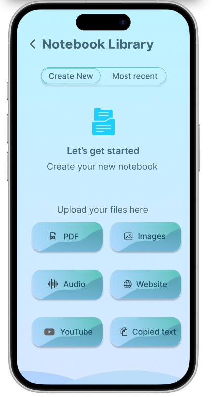

**Purpose:**

The notebook library transforms passive study materials into interactive, queryable knowledge bases using RAG. This creation screen launches that transformation by accepting diverse source types.

**Visual Elements:**

The screen presents tab navigation between notebook creation and recent notebooks. A welcoming illustration and encouragement message set a positive tone. The main content area displays source type selector buttons arranged in a grid, each labeled with the media type it accepts and styled with either solid or gradient backgrounds for visual variety.

**Design Rationale:**

The diversity of source types addresses the reality of modern learning: knowledge exists in PDFs, images, lecture recordings, web articles, YouTube tutorials, and copied snippets. By accepting all these formats, the app meets users where they are rather than forcing format conversions. The friendly welcome message ("Let's get started") maintains the supportive tone even in utilitarian screens. The visual distinction between source types using different gradients helps users quickly locate their desired input method. This screen represents the beginning of transforming overwhelming amounts of information into manageable, searchable knowledge.

---

#### Figure 5.20: Notebook Content — Library View

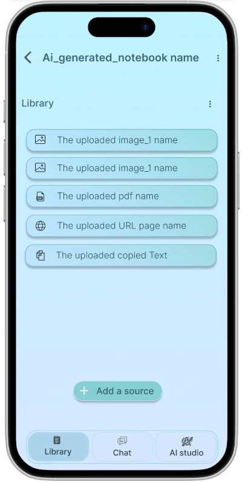

**Purpose:**

Once created, this view shows all source materials collected in a notebook, serving as the content management hub before users interact with the knowledge through chat or generation.

**Visual Elements:**

The header displays the notebook name with an edit control for renaming. The main area presents a vertical list of sources, each showing a descriptive name and a type-identifying icon. An add button enables expanding the source collection. The bottom navigation provides three tabs for different interaction modes with the notebook content.

**Design Rationale:**

The library view establishes what knowledge the AI can access when answering questions or generating materials. Type icons (image, PDF, link, text) enable quick visual scanning—users can verify they've included the lecture PDF without reading every item. The edit icon on the notebook name addresses the common issue of auto-generated names feeling impersonal. The three-tab structure separates concerns: Library (what's in it), Chat (query it), AI Studio (transform it). The "+ Add a source" button encourages building comprehensive knowledge bases rather than single-source notebooks.

---

#### Figure 5.21: Notebook — Chat Interface

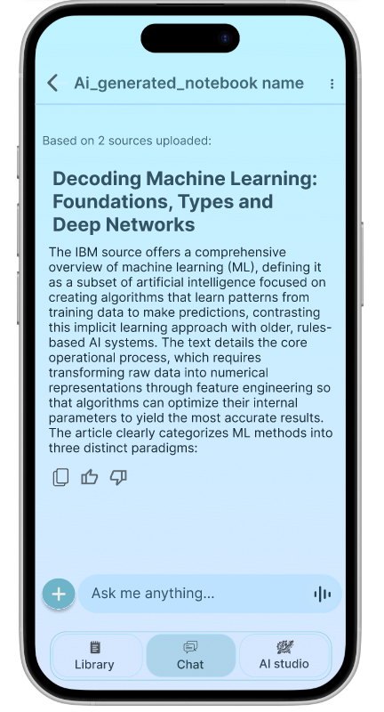

**Purpose:**

The chat interface transforms notebooks from static document collections into interactive knowledge assistants. Users can ask questions and receive answers grounded in their specific uploaded materials through RAG.

**Visual Elements:**

The header displays the notebook name and source count, establishing the knowledge base scope. The main content area shows an AI-generated summary of the notebook content with a formatted title and descriptive text. The bottom features a chat input field with placeholder text, a send button, and a microphone option for voice queries.

**Design Rationale:**

The source count ("Based on 2 sources uploaded") sets transparent expectations about the knowledge base scope—users understand the AI will answer from these materials, not general knowledge. The auto-generated summary provides immediate value before the user asks anything, demonstrating the system understood their content. This builds trust for subsequent interactions. The chat metaphor is familiar and lowers the barrier compared to formal query interfaces. "Ask me anything..." encourages experimentation. Voice input acknowledges that hands-free studying (while commuting, exercising, or doing chores) is increasingly common among students.

---

#### Figure 5.22: Notebook — AI Studio

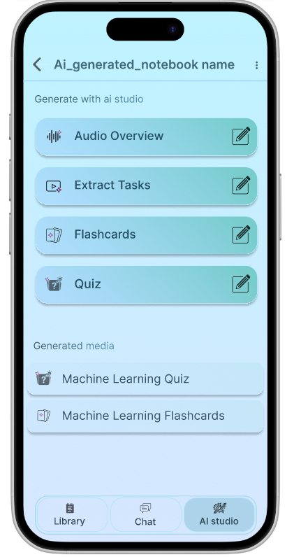

**Purpose:**

AI Studio transforms passive notebook content into active study materials and extracts actionable tasks, addressing the gap between consuming information and applying it.

**Visual Elements:**

The screen presents generation option cards, each labeled with the type of content it will create and featuring an edit icon for customization. Below this, a generated media section displays previously created items organized in a list. The AI Studio tab is active in the bottom navigation.

**Design Rationale:**

Students often struggle with the gap between reading materials and actually learning them. AI Studio bridges this by generating study aids automatically. Audio overviews accommodate auditory learners and enable passive review during commutes. Flashcards leverage spaced repetition principles for memorization. Quizzes provide active recall practice. Task extraction connects studying to action—identifying assignments and deadlines embedded in syllabi or lecture notes. The generated media section creates a persistent library, recognizing that study materials get reused before exams. Edit icons suggest customization, preventing the perception that AI outputs are inflexible or one-size-fits-all.

---

### 5.5.9 AI Companion Screen

---

#### Figure 5.23: AI Companion Chat

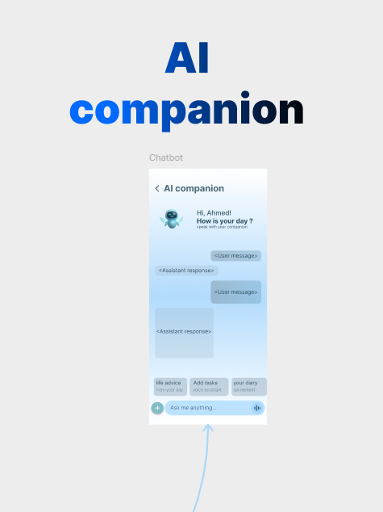

**Purpose:**

The AI Companion provides the emotional support dimension that distinguishes Sentry AI from purely productivity-focused tools. This conversational interface serves as a judgment-free space for reflection, task creation, and advice.

**Visual Elements:**

The header features the friendly robot character with a personalized greeting and invitation to talk. The main chat area displays conversation bubbles with visual distinction between user messages and AI responses following familiar messaging patterns. Quick action chips suggest specific conversation starters. The input area provides text and voice entry options.

**Design Rationale:**

Burnout has an emotional dimension that metrics alone cannot address. The companion fills this gap by offering a conversation partner that's always available and never judgmental. The personalized greeting ("Hi, Ahmed! How is your day?") creates immediate emotional connection. Quick action chips address the blank-slate problem—users experiencing burnout may lack energy to formulate questions from scratch. "Life advice from your day" positions the AI as a thoughtful counselor, not just a task manager. "Add tasks via assistant" enables natural language task creation for those who find forms burdensome. "Your diary or moment" invites emotional expression, acknowledging that sometimes people just need to vent. The chat bubble design leverages years of messaging app familiarity, making the interface feel natural rather than alien.

---

### 5.5.10 Profile & Settings Screens

---

#### Figure 5.24: Profile Settings Screen

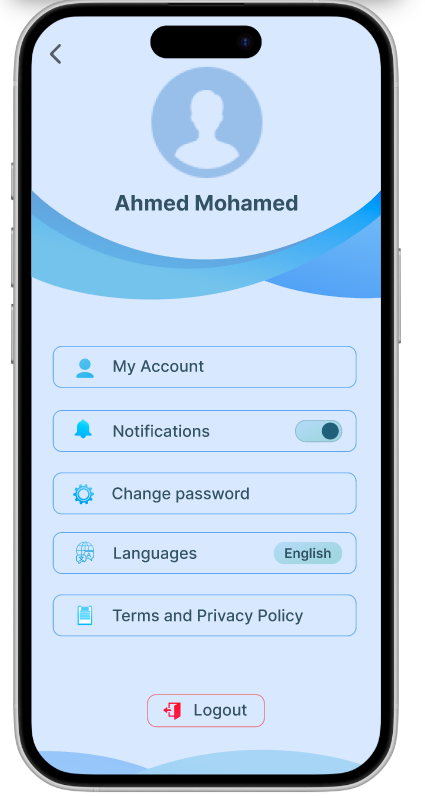

**Purpose:**

The settings screen provides access to account management and application preferences while maintaining the app's calming aesthetic even in utility screens.

**Visual Elements:**

The header features a profile picture, username, and a decorative wave gradient maintaining brand colors. The main content presents settings options as a clean vertical list with navigation arrows, inline controls like toggle switches, and current values displayed. The logout action is visually separated at the bottom with red text signaling its destructive nature.

**Design Rationale:**

Settings screens often feel utilitarian and disconnected from the main app experience. The wave gradient header maintains visual continuity with the rest of the app, reinforcing that even administrative tasks deserve a pleasant interface. Toggle switches for binary options (like notifications) enable one-tap changes without navigation. Showing current values inline (language: "English") provides status at a glance. The red logout button uses color psychology to prevent accidental account exit—red signals "stop and think" before tapping. Separating logout from other options with spacing further reduces mis-taps.

---

#### Figure 5.25: Profile — Personal Data Tab

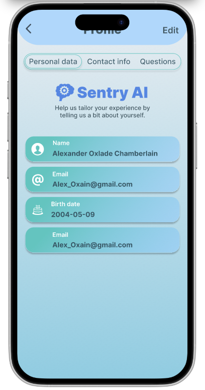

**Purpose:**

This tabbed view allows users to review and update the personal information that enables personalization throughout the app.

**Visual Elements:**

The header displays tab navigation across three information categories with the Personal Data tab active and an edit button for entering modification mode. The Sentry AI branding and personalization message appear below the tabs. Form fields display current user information including name, email, and birthdate.

**Design Rationale:**

The tabbed organization prevents a single overwhelming form by categorizing information logically. Personal Data focuses on identity, distinct from Contact Info (location) and Questions (work context). The persistent branding message reminds users why this information matters—it enables tailored experiences, not just bureaucratic data collection. Showing pre-filled data rather than empty fields reinforces what the system knows and makes verification simple. The edit button prevents accidental changes while keeping modification easily accessible. This transparency about stored data builds trust, particularly important for a mental health application handling sensitive information.

---

#### Figure 5.26: Profile — Contact Info Tab

**Purpose:**

The Contact Info tab collects location and communication data that could enable timezone-aware features and localized content.

**Visual Elements:**

The header maintains the same three-tab structure with Contact Info now active. Form fields display hierarchical location information from country to specific address, along with mobile number.

**Design Rationale:**

Separating contact information from personal data respects user cognitive load—each tab contains a manageable number of fields. Location data enables potentially valuable features: timezone-aware scheduling prevents recommendations like "take your lunch break at 3 PM" when the user's timezone makes that inappropriate. Country and city information could inform cultural context for recommendations—work culture and norms vary significantly by region. Mobile number storage prepares for potential SMS-based notifications or account recovery. The hierarchical location structure (country → city → address) follows natural geographic organization, making form completion intuitive.

---

### 5.5.11 Wireframes Overview

The wireframe diagrams show the complete application architecture and user flows.

---

#### Figure 5.27: Complete App Flow Diagram

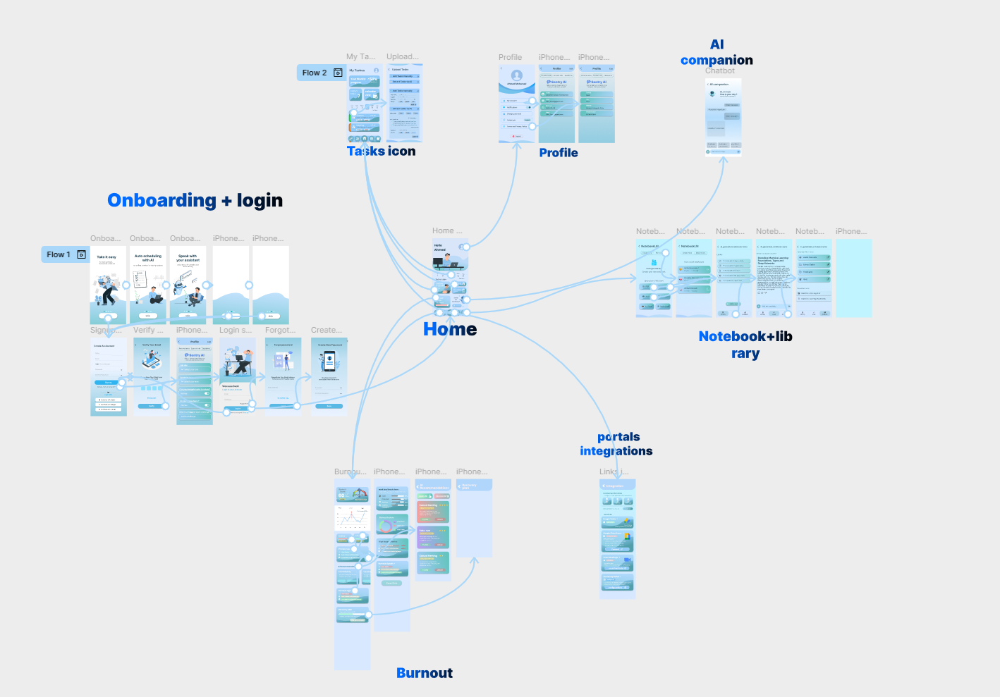

**Purpose:**

This comprehensive flow diagram provides a high-level architectural view of the entire application, showing how all screens connect and how users navigate between features.

**Visual Elements:**

The diagram centers on the Home screen with all major feature sections radiating outward in a hub-and-spoke pattern. The onboarding and login flow appears as a separate branch. Color-coded groupings distinguish different functional areas, with connecting lines indicating navigation paths between screens.

**Design Rationale:**

The hub-and-spoke model visible in this diagram reflects a deliberate information architecture decision: users should always know where they are and how to get anywhere else. The central Home screen prevents users from getting lost deep in feature hierarchies. Color coding helps stakeholders and developers quickly identify related screens—all burnout analysis screens share a color, all notebook screens share another. This diagram also reveals depth of navigation: most features are 2-3 taps from Home, preventing the frustration of deeply nested interfaces. For users experiencing burnout, minimizing navigation complexity reduces cognitive load and decision fatigue.

---

#### Figure 5.28: Onboarding + Login Flow

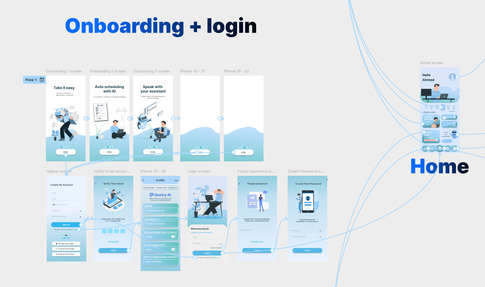

**Purpose:**

This focused wireframe details the critical first-time user journey from app discovery through onboarding to active use.

**Visual Elements:**

The flow diagram shows the sequential onboarding screens, then branches into parallel login and signup paths. The signup path includes email verification before both paths converge at profile setup and ultimately lead to the Home screen.

**Design Rationale:**

The first-time user experience determines whether users commit to the app or abandon it. This flow reveals deliberate friction reduction: onboarding screens can be skipped (visible in earlier designs), login and signup are parallel paths (not nested), and email verification happens after signup commitment rather than blocking initial registration. The profile setup positioned at the end ensures users see the app's value before being asked for detailed information. Each step in this flow was designed to minimize abandonment risk—every additional required field or screen increases the chance users quit. For a burnout app specifically, respecting users' limited energy during onboarding is critical.

---

#### Figure 5.29: Tasks and Profile Flow

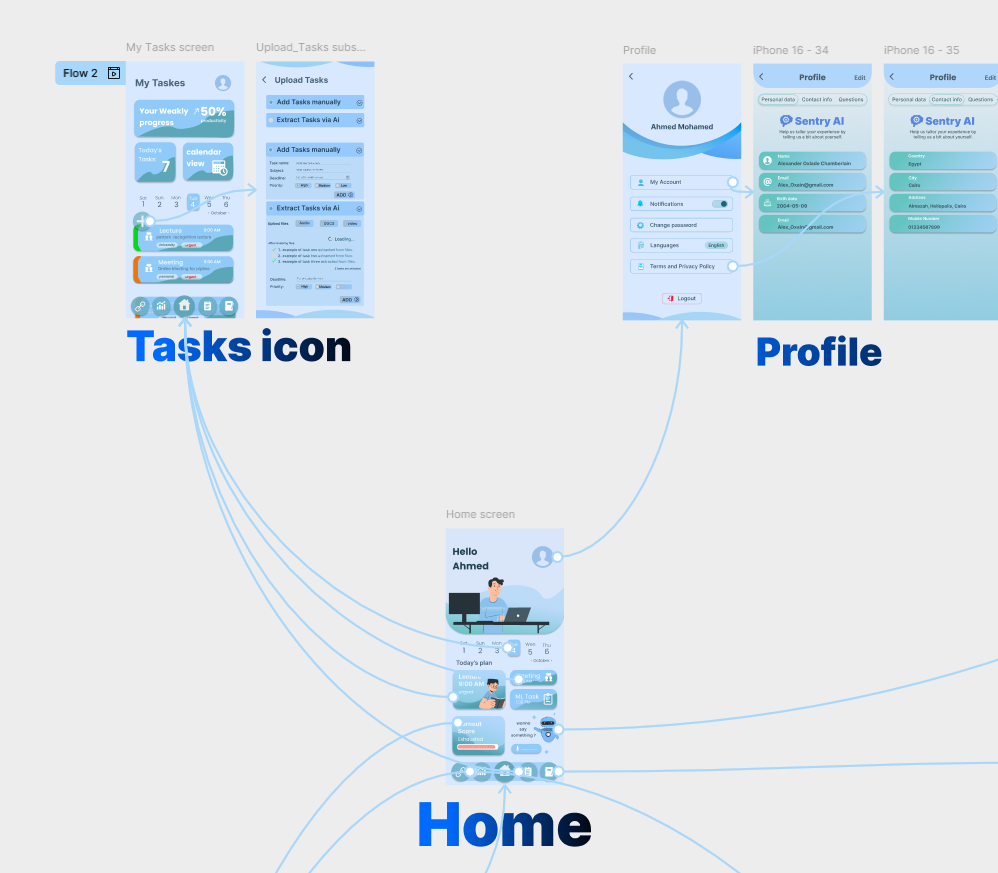

**Purpose:**

This wireframe isolates two essential but structurally different feature sets: task management (core workflow) and profile management (configuration).

**Visual Elements:**

The diagram shows two distinct flows originating from Home. The tasks section displays the path from task viewing to task upload. The profile section shows the hierarchical navigation through settings and the three-tabbed profile screens.

**Design Rationale:**

Tasks and profiles serve fundamentally different purposes, reflected in their flow structures. Tasks follow an action-oriented flow: view → create/upload, supporting the high-frequency operation of task management. Profile follows a settings-oriented structure: access settings → navigate to specific information category, supporting infrequent modification operations. The shallow depth of both flows (2-3 screens maximum) ensures users never feel trapped. Task upload as a dedicated screen rather than a modal acknowledges the potential complexity of AI extraction—users might spend time reviewing and selecting extracted tasks, warranting a full screen rather than an overlay.

---

#### Figure 5.30: Notebook Library Flow

**Purpose:**

This wireframe details the notebook feature's complete user journey from creation through interaction to content generation.

**Visual Elements:**

The flow shows notebook creation as the entry point, leading to the library view where sources are managed. From there, the three-tab structure branches into parallel paths: the chat interface for querying content, the AI Studio for generating study materials, and the library view for content management.

**Design Rationale:**

The notebook flow represents a sophisticated feature that could easily become confusing without clear structure. The three-tab organization visible in this wireframe ensures users understand the three modes of interaction: managing content (Library), asking questions (Chat), and creating study materials (AI Studio). Unlike linear flows, this circular structure allows users to move freely between modes—adding sources, then chatting, then generating flashcards, then adding more sources. This flexibility matches actual study workflows, which are iterative rather than sequential. The wireframe also reveals that all three tabs are always accessible, preventing users from needing to back out to switch modes.

---

#### Figure 5.31: Burnout and Integrations Flow

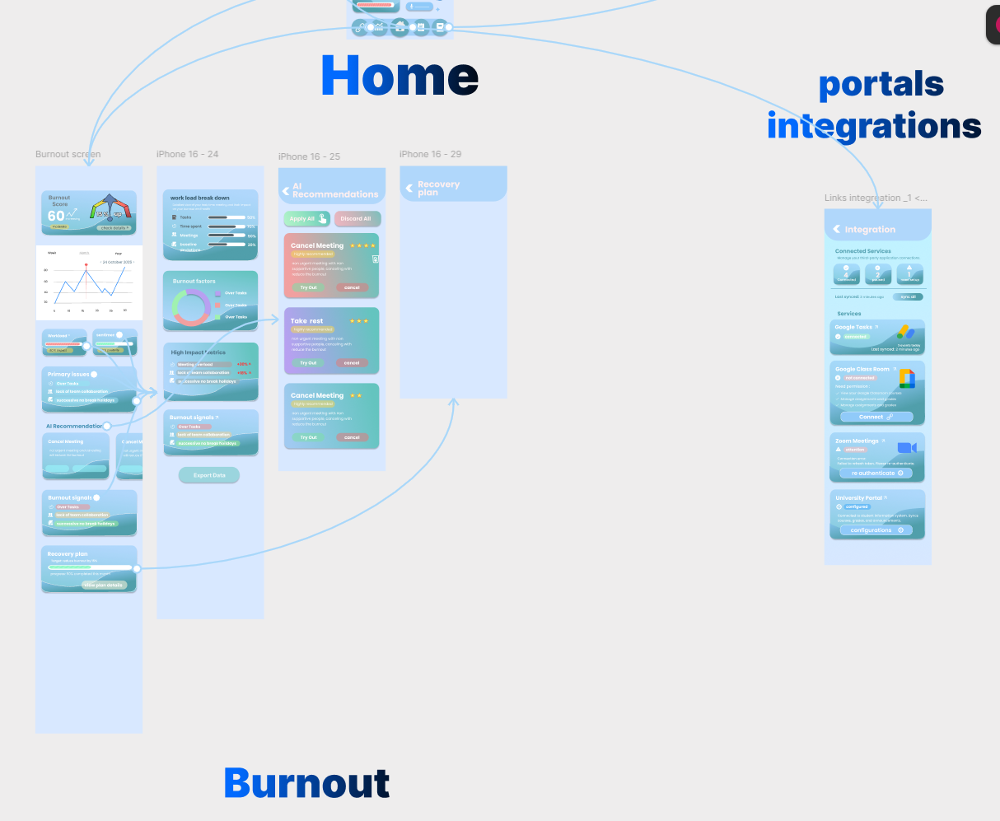

**Purpose:**

This final wireframe shows the core value proposition of Sentry AI: the flow from burnout detection through analysis to actionable recommendations, plus the integrations that power the analysis.

**Visual Elements:**

The diagram presents the burnout analysis flow as a progressive disclosure path from score overview through detailed breakdowns to workload analysis and ultimately recommendations. A separate integrations flow shows service management and configuration. Both flows originate from Home.

**Design Rationale:**

This wireframe reveals the strategic progression that transforms data into action. Users start with a simple score—immediate understanding without overwhelming detail. Each subsequent screen adds depth: details explain what contributes to the score, workload breakdown quantifies the primary factors, and recommendations provide concrete actions. This progressive disclosure respects users' varying needs—some want just the score, others want comprehensive analysis. The recommendations screen as the terminal node emphasizes that analysis exists to serve action, not curiosity. The integrations flow appearing on the same wireframe highlights the data dependency: accurate burnout analysis requires integrated calendar and task data. Together, these flows show how Sentry AI closes the loop: integrate data → analyze burnout → recommend actions → (user implements) → analyze improved state.

---

## 5.6 Responsive Design Considerations

### 5.6.1 Mobile-First Approach

Sentry AI was designed mobile-first, recognizing that users often check their burnout status throughout the day from their phones. The mobile interface prioritizes:

- **Thumb-friendly navigation** with bottom tab bar
- **Touch-optimized targets** (minimum 44x44 points)
- **Scannable content** optimized for quick glances
- **One-handed operation** for common tasks

### 5.6.2 Component Consistency

Design components maintain consistency across all screens:
- Card corner radius remains constant
- Button styles are uniform
- Spacing follows a consistent grid
- Typography scale is applied systematically

---

## 5.7 Accessibility Considerations

### 5.7.1 Visual Accessibility

- **Contrast ratios** meet WCAG 2.1 AA requirements
- **Color is not the sole indicator** — text labels accompany color-coded status
- **Text remains readable** at various sizes
- **Focus states** are clearly visible

### 5.7.2 Interaction Accessibility

- **Touch targets** meet minimum size requirements
- **Clear labels** on all interactive elements
- **Logical reading order** for screen readers
- **Alternative text** for illustrations

---

## 5.8 Summary

The UI/UX design of Sentry AI reflects a deep understanding of the psychological needs of users experiencing burnout. The light blue color palette creates calm. Friendly illustrations humanize the experience. Clear navigation prevents frustration. Progressive disclosure manages cognitive load.

The 30+ screens across seven functional areas create a comprehensive interface for:
- Onboarding and authentication (9 screens)
- Task management (2 screens)
- Burnout analysis and recommendations (4 screens)
- AI companion interaction (1 screen)
- Notebook library (4 screens)
- Integrations (2 screens)
- Profile and settings (3 screens)
- Wireframes and flow documentation (5 screens)

Every design decision—from the color of a button to the wording of a prompt—was made with the user's well-being in mind. The result is an interface that doesn't just display information about burnout; it actively contributes to the user's sense of calm, control, and hope.
