# 6. SYSTEM DESIGN AND ARCHITECTURE

This chapter presents the architectural design of Sentry AI, detailing the system structure, design patterns, service responsibilities, and key technical decisions that enable burnout detection and personalized recommendation delivery.

---

## 6.1 System Overview

### 6.1.1 Architectural Philosophy

Sentry AI follows a **service-oriented architecture** where distinct functional domains are organized as cohesive services. This approach balances the benefits of modularity with the simplicity of deployment, avoiding the operational complexity of full microservices while maintaining clear separation of concerns.

**Key Architectural Principles:**

1. **Separation of Concerns:** Each service handles a specific domain (authentication, burnout analysis, task extraction, etc.)
2. **Shared Database, Isolated Logic:** Services share a PostgreSQL database but maintain independent business logic
3. **API-First Design:** All functionality exposed through well-defined RESTful endpoints
4. **Stateless Services:** No server-side session storage; authentication via JWT tokens
5. **Async Processing:** Background tasks for time-consuming operations (AI processing, external API calls)

### 6.1.2 High-Level Architecture

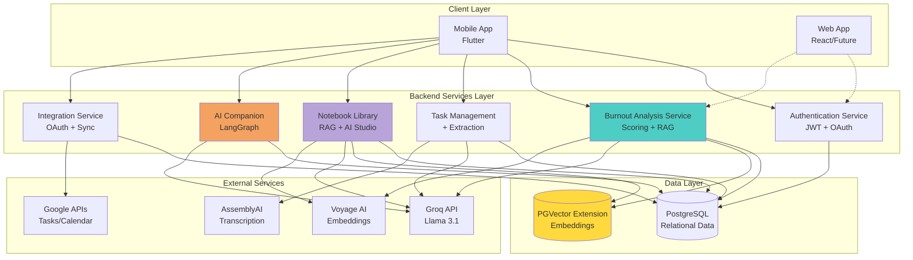

**Figure 6.1:** High-level system architecture showing the client layer, backend services, data storage, and external service dependencies.

---

## 6.2 Technology Stack Rationale

### 6.2.1 Backend Framework: FastAPI

**Choice:** FastAPI (Python web framework)

**Rationale:**
- **Native Async Support:** Critical for non-blocking I/O during external API calls (Groq, AssemblyAI, OAuth)
- **Automatic API Documentation:** OpenAPI/Swagger generation reduces documentation burden
- **Type Safety:** Pydantic models provide runtime validation and IDE autocomplete
- **Performance:** Comparable to Node.js and Go for I/O-bound operations
- **Python Ecosystem:** Direct access to ML/AI libraries (LangChain, LangGraph, scikit-learn)

### 6.2.2 Database: PostgreSQL + PGVector

**Choice:** PostgreSQL 14+ with PGVector extension

**Rationale:**

**PostgreSQL:**
- **ACID Compliance:** Ensures data consistency for critical burnout scores and user data
- **Rich Data Types:** JSON columns for flexible metric storage
- **Mature Ecosystem:** Well-understood, production-proven
- **Free and Open Source:** No licensing costs

**PGVector Extension:**
- **Unified Storage:** Embeddings and relational data in same database
- **Similarity Search:** Native cosine similarity for RAG retrieval
- **Simplicity:** Avoids managing separate vector database (Pinecone, Weaviate)
- **Performance:** Adequate for user-scale workloads (thousands of users)

### 6.2.3 LLM: Groq-Hosted Llama 3.1

**Choice:** Groq API (Llama 3.1 70B)

**Rationale:**
- **Speed:** Groq's LPU inference delivers 10x faster responses than traditional GPUs
- **Cost:** Significantly cheaper than OpenAI GPT-4 for comparable quality
- **Open Weights:** Llama models can be self-hosted if needed in future
- **Reliability:** Hosted solution avoids GPU infrastructure management

### 6.2.4 Embedding Model: Voyage AI

**Choice:** Voyage AI `voyage-2` model

**Rationale:**
- **Quality:** Outperforms OpenAI embeddings on retrieval benchmarks
- **Cost-Effective:** Lower per-token cost than OpenAI
- **Optimized for RAG:** Specifically designed for retrieval tasks
- **Batch Processing:** Efficient for processing guidebook chunks

### 6.2.5 Speech-to-Text: AssemblyAI

**Choice:** AssemblyAI Universal-1 model

**Rationale:**
- **Accuracy:** State-of-the-art transcription quality
- **Speaker Diarization:** Identifies different speakers in meetings
- **Async API:** Webhook-based processing fits FastAPI architecture
- **Multilingual:** Supports future expansion to non-English users

---

## 6.3 Core Architecture Patterns

### 6.3.1 API Gateway Pattern (Simplified)

While Sentry AI doesn't use a dedicated API Gateway service, the backend follows gateway principles:

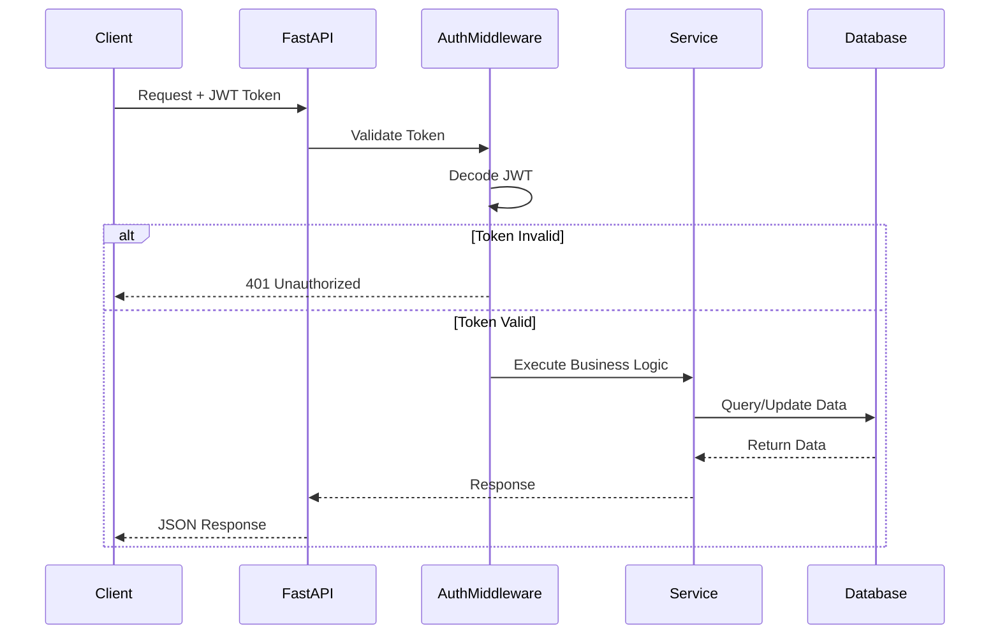

**Figure 6.2:** Request flow through authentication middleware and service layers.

**Key Principles:**
- **Centralized Authentication:** JWT validation middleware applied globally
- **CORS Handling:** Configured at application level
- **Error Handling:** Consistent exception handling across all endpoints
- **Rate Limiting:** (Future) Can be added at middleware layer

### 6.3.2 Repository Pattern (Data Access)

Services interact with the database through SQLAlchemy ORM, following repository-like patterns. The repository pattern encapsulates data access logic by providing methods for common database operations such as retrieving user profiles, saving burnout analyses, and fetching recent analyses within a specified timeframe. This pattern initializes with a database session that handles all queries and transactions.

**Benefits:**
- **Testability:** Database logic can be mocked
- **Reusability:** Common queries centralized
- **Maintainability:** Schema changes localized to repository

### 6.3.3 Dependency Injection

FastAPI's dependency injection system provides database sessions and authentication through a dependency provider function that creates a database session, yields it to the endpoint, and ensures proper cleanup in a finally block. Endpoints declare dependencies using FastAPI's Depends mechanism, which automatically injects database sessions and the current authenticated user into endpoint functions. This eliminates the need for manual session creation and ensures resources are properly released.

**Benefits:**
- **Clean Code:** No manual session management in endpoints
- **Automatic Cleanup:** Database connections closed even on errors
- **Type Safety:** Dependencies are type-checked

---

## 6.4 Authentication and Authorization Architecture

### 6.4.1 Authentication Flow

Sentry AI supports both email/password and OAuth (Google, Apple, Facebook) authentication:

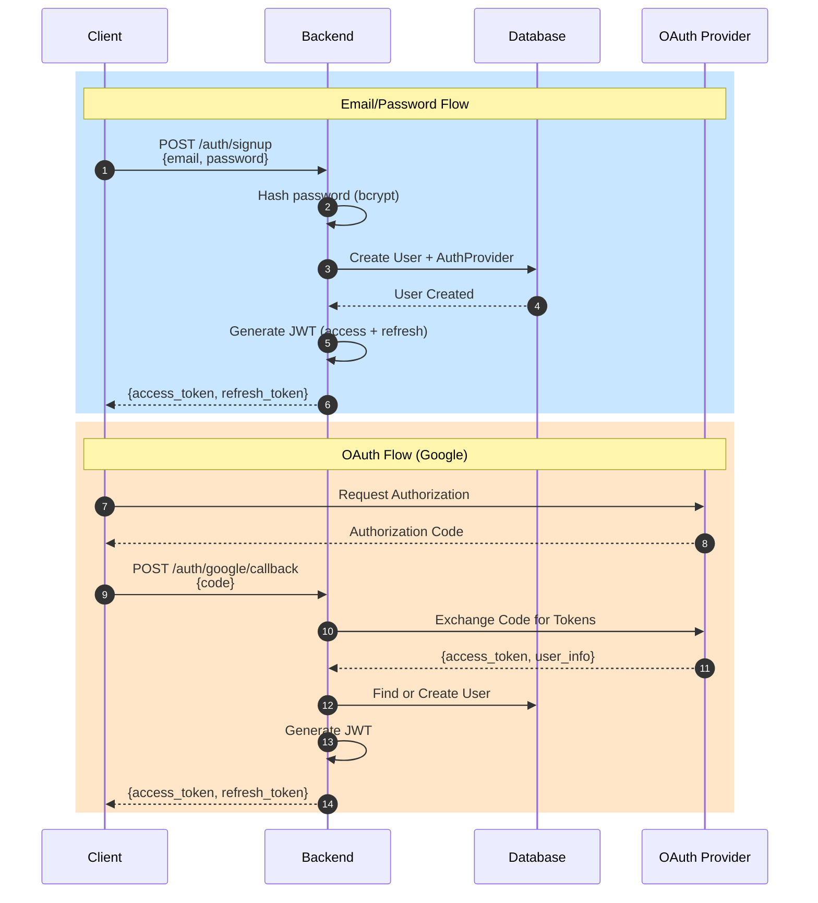

**Figure 6.3:** Dual authentication flow supporting email/password and OAuth providers.

### 6.4.2 JWT Token Structure

**Access Token (Short-lived: 15 minutes):**
The access token payload contains the user ID as the subject claim, the user's email address, an expiration timestamp set to 15 minutes from issuance, and an issued-at timestamp. This token is used for authenticating API requests and expires quickly to minimize security risks.

**Refresh Token (Long-lived: 7 days):**
The refresh token payload contains the user ID as the subject claim, a type field identifying it as a refresh token, an expiration timestamp set to 7 days from issuance, and an issued-at timestamp. This token is used to obtain new access tokens without requiring re-authentication.

**Security Measures:**
- **Short Access Token Lifetime:** Limits exposure if token stolen
- **Refresh Token Rotation:** New refresh token issued on each refresh
- **HTTPS Only:** Tokens transmitted over encrypted connection
- **HttpOnly Cookies (Future):** Additional XSS protection for web clients

### 6.4.3 Authorization Strategy

**Role-Based Access Control (RBAC) - Simple Implementation:**

Currently, Sentry AI uses **user-level authorization** where users can only access their own data. The authorization approach extracts the user from the JWT token by decoding it and retrieving the user ID from the subject claim, then loads the full user object from the database. Endpoints that require authentication use this current user dependency, which implicitly ensures users can only access their own data since all operations use the authenticated user's ID. This creates a secure isolation boundary where each user's data remains private.

**Future Extension:** Admin roles for organizational deployments.

---

## 6.5 Data Architecture

### 6.5.1 Database Schema Design

The database schema is organized around core entities with clear relationships:

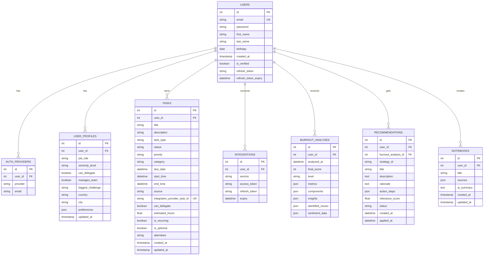

**Figure 6.4:** Entity-Relationship Diagram showing core database tables and relationships.

### 6.5.2 Key Design Decisions

**1. JSON Columns for Flexibility**

Tables like `burnout_analyses` use JSON columns for storing complex, evolving data structures. The metrics column stores workload-related data including counts of total active tasks, overdue tasks, work hours for the current day, number of meetings scheduled, and instances of back-to-back meetings. This JSON format allows for flexible storage of metrics that may vary between users or evolve over time as new metrics are added to the system.

**Benefits:**
- **Schema Evolution:** Add new metrics without ALTER TABLE
- **Denormalization:** Faster reads for historical analysis
- **Flexibility:** Different users may have different metric sets

**Trade-offs:**
- **Query Complexity:** JSONB queries less efficient than indexed columns
- **Type Safety:** Application must validate JSON structure

**2. Unified Integration Provider ID**

The `tasks` table includes `integration_provider_task_id` to track external task IDs from any source. This field stores provider-specific identifiers such as Google Tasks IDs with a "google_tasks_" prefix, Google Classroom IDs with a "google_classroom_" prefix, or NULL for tasks created manually or extracted from audio recordings. The consistent naming convention allows the system to identify the task's origin and prevent duplicate imports.

**Benefits:**
- **Extensibility:** New integrations don't require schema changes
- **Deduplication:** Prevents duplicate tasks from same source

**3. Separate User Profiles Table**

User authentication data (`users`) separated from profile data (`user_profiles`):

**Rationale:**
- **Security:** Authentication credentials isolated
- **Performance:** Profile queries don't touch sensitive data
- **Scalability:** Profiles can be cached independently

### 6.5.3 Vector Database Design

The `guidebook_strategies` table stores RAG knowledge base using PGVector. The table schema includes a serial primary key, a unique strategy identifier, a category field for filtering strategies by type (workload, time management, meetings, etc.), title and description fields for the strategy content, metadata about when to use the strategy, action steps stored as JSONB, prerequisites stored as JSONB, expected outcomes, time investment estimates, difficulty levels, and a vector column storing 1024-dimensional embeddings from Voyage AI. An IVFFlat index on the embedding column enables fast approximate nearest neighbor searches using cosine similarity operations with 100 inverted lists for optimal performance.

**Figure 6.5:** Guidebook strategies table schema with vector embeddings.

**Key Features:**
- **Vector Column:** Stores 1024-dimensional Voyage AI embeddings
- **IVFFlat Index:** Approximate nearest neighbor search for performance
- **Cosine Similarity:** Measures semantic similarity between query and strategies
- **Structured Metadata:** Category, prerequisites enable filtering before vector search

**Example Strategy Record:**
A typical strategy record contains a unique identifier like "cancel_low_value_meetings", categorized under "meeting_management" with a descriptive title. The strategy includes detailed descriptions of what it accomplishes, guidance on when to apply it (such as when meeting overload is the primary burnout driver), concrete action steps (reviewing recent meetings, identifying low-value ones, and sending timely cancellation notices), prerequisites indicating the user must have calendar management authority and the ability to decline meetings, expected outcomes quantifying the impact (reducing meeting hours by 15-25%), estimated time investment (15 minutes), difficulty classification (low), and a 1024-dimensional embedding vector for semantic similarity searches.

### 6.5.4 Indexing Strategy

**Primary Indexes (Automatic):**
- Primary keys on all `id` columns
- Unique constraints on `email`, `integration_provider_task_id`

**Secondary Indexes (Performance):**
The database implements targeted secondary indexes to optimize common query patterns. User email lookups are accelerated with a dedicated index on the email column. Task queries benefit from composite indexes on user ID combined with due date and user ID combined with status, enabling efficient filtering of user-specific tasks by their deadlines or completion state. Burnout analyses use a descending index on user ID and analysis timestamp to support time-series queries showing burnout trends over time. Integration lookups leverage a composite index on user ID and service name for fast retrieval of connected accounts. Vector similarity searches use an IVFFlat index on the embedding column with cosine similarity operations to enable efficient semantic search across strategies.

**Index Selection Rationale:**
- **User ID:** Most queries filter by user (multi-tenant pattern)
- **Timestamps:** Trend analysis queries filter by date ranges
- **Composite Indexes:** Common query patterns (user + date, user + status)
- **Vector Index:** IVFFlat provides ~95% recall with 10x speedup over brute force

---

## 6.6 Service Design

This section details the architecture of each major service within Sentry AI.

### 6.6.1 Authentication Service

**Responsibilities:**
- User registration and login (email/password and OAuth)
- JWT token generation and validation
- Token refresh mechanism
- Email verification (future)

**Architecture:**

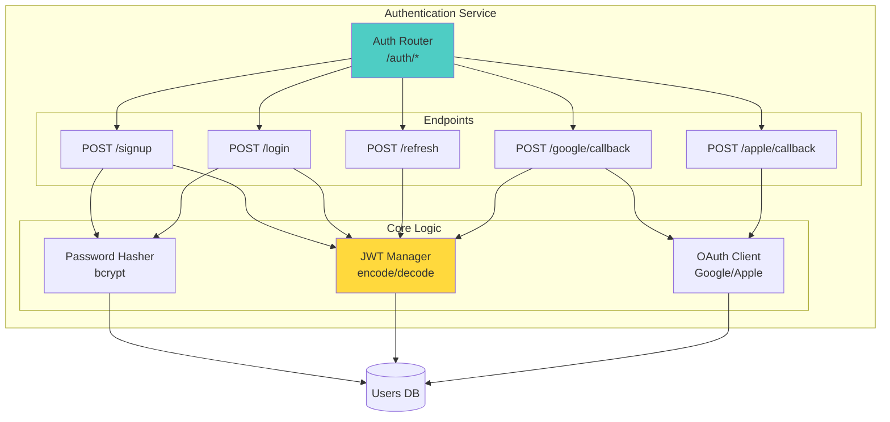

**Figure 6.6:** Authentication service architecture showing endpoints and core components.

**Key Design Patterns:**

**Password Hashing:**
Passwords are secured using bcrypt with a cost factor of 12, which provides strong protection against brute-force attacks. The password is first encoded to UTF-8 bytes, then hashed using bcrypt's automatic salt generation, ensuring each password receives a unique salt value that's embedded in the final hash.

**JWT Generation:**
Access tokens are created by constructing a payload containing the user ID as the subject claim (converted to string), an expiration timestamp calculated by adding the specified delta (defaulting to 15 minutes) to the current UTC time, and an issued-at timestamp recording when the token was created. This payload is then encoded using the HMAC-SHA256 algorithm with the application's secret key, producing a signed JWT that can be verified on subsequent requests.

**Security Considerations:**
- **Salted Password Hashing:** Each password gets unique salt (bcrypt automatic)
- **Token Expiry:** Short-lived access tokens (15 min)
- **Refresh Token Rotation:** Prevents long-term token theft impact
- **HTTPS Enforcement:** Tokens only transmitted over TLS

---

### 6.6.2 Burnout Analysis Service

**Responsibilities:**
- Calculate multi-dimensional burnout scores (workload + sentiment)
- Maintain user-specific baselines
- Identify primary burnout drivers
- Store analysis history for trends
- Generate RAG-based recommendations

**Architecture:**

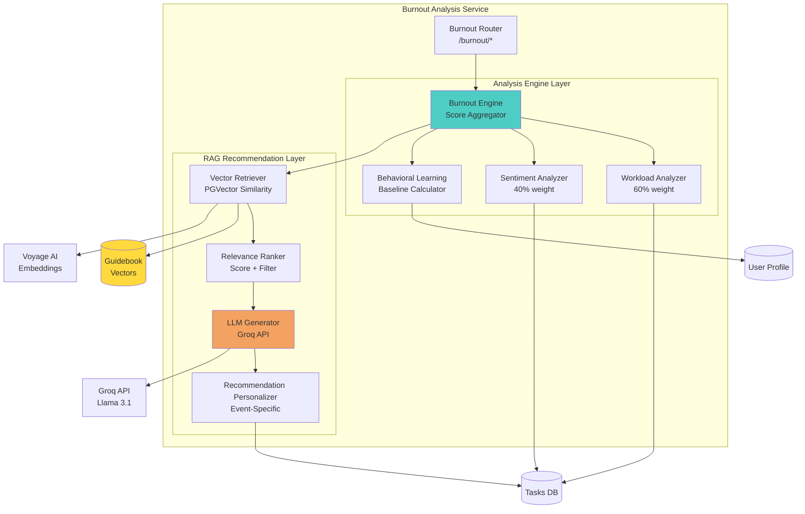

**Figure 6.7:** Burnout analysis service architecture with analysis engine and RAG recommendation layers.

**Component Details:**

**1. Workload Analyzer (60% Weight)**

Analyzes quantitative workload metrics by fetching current user metrics and calculating three weighted components. The task-based component (30% of workload) evaluates the total number of active tasks and overdue tasks compared to the user's baseline average. The time-based component (40% of workload) assesses daily and weekly work hours against the user's typical work schedule. The meeting-based component (30% of workload) analyzes the number of meetings, total meeting hours, and instances of back-to-back meetings relative to the user's normal meeting load. These three scores are combined into a total workload score while preserving individual component values for detailed analysis of burnout drivers.

**Scoring Logic:**
- **Baseline Comparison:** User's current metrics vs. their historical average
- **Threshold Detection:** Flags when metrics exceed 120% of baseline
- **Pattern Recognition:** Identifies concerning trends (e.g., consecutive long days)

**2. Sentiment Analyzer (40% Weight)**

Analyzes qualitative emotional indicators by collecting text from multiple sources including diary entries, daily check-ins, and AI companion chat messages from the past 7 days. These text fragments are concatenated into a unified corpus that captures the user's recent emotional state. The combined text is processed by an LLM-based sentiment classifier that evaluates emotional tone and returns a structured assessment including polarity (ranging from -1 for negative to +1 for positive), intensity (scaled from 0 to 1 indicating strength of emotion), and the dominant emotion category (such as anxiety, frustration, exhaustion, calm, or motivated). The polarity value is then mapped to an adjustment score that contributes to the overall burnout calculation.

**Sentiment Classification Prompt:**
The LLM receives instructions to analyze the emotional tone of user journal entries and check-ins, classifying sentiment across three dimensions: polarity scored on a scale from negative (-1) through neutral (0) to positive (+1), intensity categorized as low (0.3), medium (0.6), or high (1.0), and dominant emotion identified from categories including anxiety, frustration, exhaustion, calm, and motivated. The prompt requests structured JSON output containing these three classification values to ensure consistent parsing and integration into the burnout scoring system.

**3. Burnout Engine (Score Aggregator)**

Combines workload and sentiment into final score by first retrieving or creating the user's behavioral baseline, then calculating both workload and sentiment component scores. The base burnout score applies a weighted combination formula giving 60% weight to workload metrics and 40% weight to sentiment polarity. An additional sentiment adjustment score is then added to account for emotional intensity. The resulting score is clamped to a valid range of 0-100 to ensure consistency. The numeric score is classified into a risk level (GREEN, YELLOW, or RED), and primary burnout drivers are identified by analyzing which components contribute most significantly to the elevated score. All results are packaged into a comprehensive BurnoutAnalysis object that includes the user ID, final score, risk level, individual component scores, identified issues, and analysis timestamp.

**Level Classification:**
- **GREEN (0-39):** Healthy workload, positive sentiment
- **YELLOW (40-69):** Moderate risk, attention needed
- **RED (70-100):** Critical burnout, immediate intervention required

**4. Behavioral Learning (Baseline Calculator)**

Learns user-specific "normal" levels by retrieving the past 30 days of burnout analysis history for the user. If fewer than 7 analyses exist, the system falls back to global defaults since insufficient data prevents accurate personalization. With adequate history, rolling averages are calculated for key metrics including active task counts, daily work hours, and daily meeting frequency. The system also performs pattern detection to identify behavioral characteristics such as whether the user regularly works on weekends and their typical work schedule (early morning versus late night patterns). These calculated averages and detected patterns form a personalized baseline that represents the user's normal operating state, enabling more accurate detection of concerning deviations.

**Benefits:**
- **Personalization:** "Too many meetings" differs per user
- **Pattern Recognition:** Learns individual work rhythms
- **Adaptive:** Baselines update as user behavior changes

---

### 6.6.3 RAG Recommendation Engine

**Responsibilities:**
- Retrieve relevant strategies from guidebook via vector similarity
- Rank strategies by relevance and user constraints
- Generate personalized, event-specific recommendations using LLM
- Track recommendation effectiveness

**Architecture:**

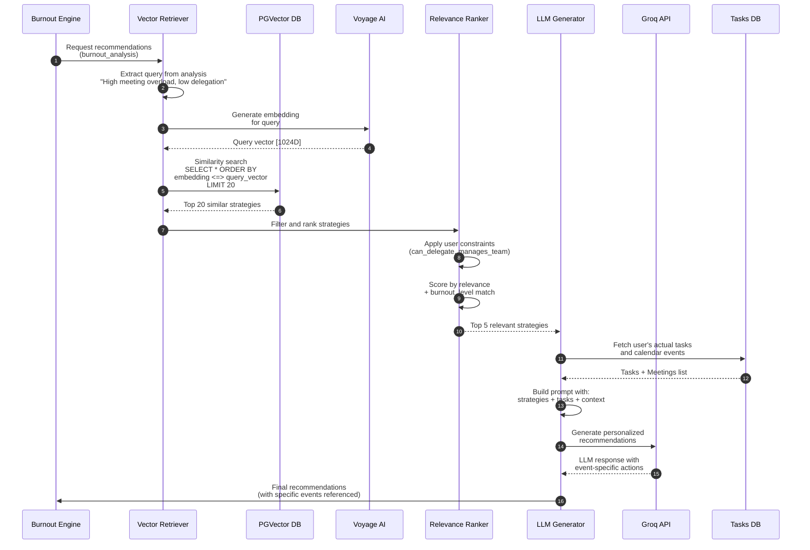

**Figure 6.8:** RAG recommendation pipeline sequence diagram showing retrieval, ranking, and generation flow.

**Component Details:**

**1. Vector Retriever**

Performs semantic search over guidebook strategies by first constructing a natural language query that describes the user's burnout situation, including specific details like meeting overload severity, delegation capabilities, and identified stressors. This query text is converted into a 1024-dimensional embedding vector using the Voyage AI embedding service. A PGVector similarity search is then executed against the guidebook_strategies table, using the cosine distance operator to find strategies whose embeddings are semantically closest to the query embedding. The database returns the top-k most similar strategies (default 20) ordered by increasing distance, including all relevant strategy metadata such as IDs, titles, descriptions, categories, action steps, and prerequisites. These database rows are then hydrated into full Strategy objects for further processing.

**PGVector Operator:**
- `<=>` : Cosine distance (lower = more similar)
- Returns top-k strategies ordered by semantic similarity

**2. Relevance Ranker**

Filters and re-ranks retrieved strategies based on user context by iterating through candidate strategies and applying multiple scoring factors. The base similarity score is derived by inverting the cosine distance (producing a 0-1 similarity metric). Each strategy is first checked against prerequisite constraints based on the user's profile; strategies requiring capabilities the user lacks (such as delegation authority) are immediately excluded. For qualifying strategies, category relevance boosting amplifies scores when the strategy's category aligns with the user's primary burnout issues. An additional level-matching factor adjusts scores based on whether the strategy's difficulty level is appropriate for the user's current burnout severity (favoring low-difficulty quick wins for high-burnout users). The final score multiplies the base similarity by these boosting factors, and the top 5 highest-scoring strategies are returned.

**Filtering Logic:**
- **Prerequisites Check:** If strategy requires `can_delegate=True`, skip for users who can't delegate
- **Category Boosting:** If "meeting_overload" is primary issue, boost meeting-related strategies
- **Difficulty Matching:** For RED-level burnout, prefer "low" difficulty strategies (quick wins)

**3. LLM Generator (Personalization)**

Transforms generic strategies into event-specific recommendations by building comprehensive context from the user's tasks, profile, and burnout analysis. For each ranked strategy, a detailed prompt is constructed that includes the generic strategy template and rich user-specific context. The LLM is called with a low temperature setting (0.3) to ensure consistent, focused outputs rather than creative variations. The LLM response is parsed into structured recommendation data including a concise title, descriptive paragraph, rationale explaining the burnout reduction benefit, and specific action steps that reference actual events from the user's calendar. Each generated recommendation is linked to the user, burnout analysis, and original strategy, with the relevance score preserved and status initialized to pending.

**Prompt Template:**
The LLM receives a comprehensive prompt positioning it as a burnout prevention assistant with access to both the generic strategy (title, description, and action steps) and detailed user context including burnout level and score, identified primary issues, job role, delegation capability, team management status, and today's complete schedule formatted with actual tasks and meetings. The prompt instructs the LLM to adapt the generic strategy to the user's specific situation by referencing actual calendar events and creating actionable, concrete steps. The expected output format specifies structured JSON containing a short actionable title, explanatory description paragraph, burnout reduction rationale, and numbered action steps that incorporate specific event references from the user's schedule.

**Example Generated Recommendation:**

**Generic Strategy:**
The generic strategy provides a high-level approach titled "Cancel Low-Value Recurring Meetings" with three basic steps: reviewing recurring meetings, identifying those providing little value, and sending cancellation notices.

**Personalized Recommendation (Event-Specific):**
The personalized version identifies a specific meeting ("Team Sync" at 3:30 PM) that the system detected the user hasn't actively participated in during the last three occurrences, noting it creates scheduling pressure by following a 2:00 PM client call. The recommendation quantifies the impact (12% reduction in weekly meeting hours) and provides concrete action steps including exact messaging to send the organizer, instructions to decline all future occurrences, and a suggested alternative use for the freed time as a buffer period after client calls. This transformation makes the generic advice immediately actionable with specific calendar events, precise impact metrics, and ready-to-use communication templates.

**Benefits of Event-Specific Recommendations:**
- **Immediate Actionability:** User knows exactly what to do
- **Low Friction:** References specific calendar events
- **Personalized Impact Metrics:** "12% reduction" is user-specific
- **Confidence:** User sees the AI understands their actual situation

---

## 6.7 Task Extraction Service

**Responsibilities:**
- Extract tasks from multi-modal inputs (audio, PDFs, images, handwritten notes)
- Parse structured task information using LLM
- Integrate with task database

**Architecture:**

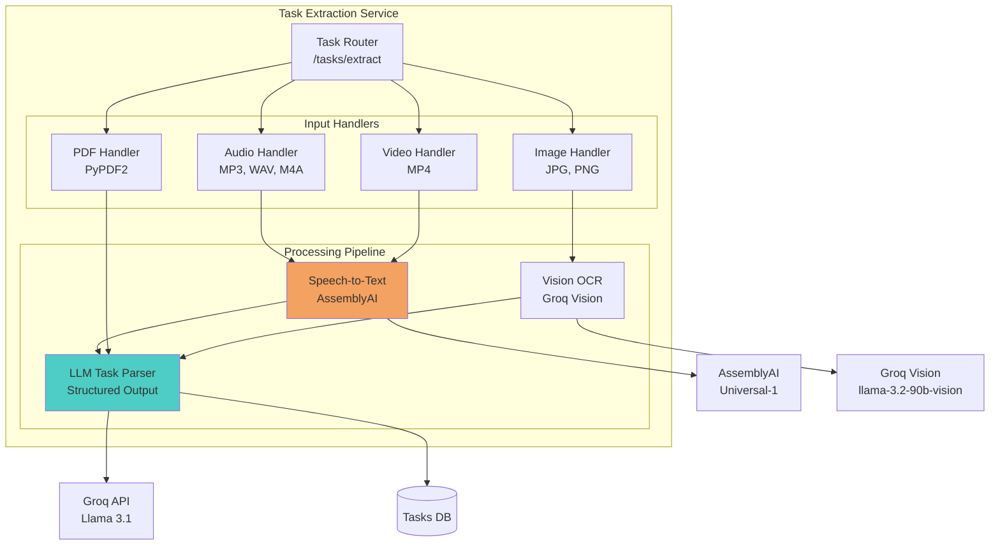

**Figure 6.9:** Task extraction service architecture showing multi-modal input handling and LLM-based parsing.

**Processing Pipeline:**

**1. Audio/Video → Speech-to-Text**

The audio transcription process uploads the audio file to AssemblyAI's service, then submits a transcription request with speaker diarization enabled to identify different speakers and automatic language detection to handle multilingual content. The system polls the transcription job until completion and returns the final transcript text. This asynchronous approach allows handling long audio files without blocking the application.

**2. Images → OCR (Vision Model)**

Image text extraction converts the uploaded image file to base64 encoding, then sends it to the Groq Vision API using the llama-3.2-90b-vision model. The API request includes both a text instruction to extract all visible text and the base64-encoded image data. The vision model analyzes the image and returns the extracted text content, handling both typed text and handwritten notes.

**3. Text → Structured Tasks (LLM Parsing)**

Task parsing from text uses an LLM to extract structured task information from unstructured content. The prompt instructs the LLM to identify all tasks and deadlines in the provided text and return them as a JSON array with specific fields including title, description, due date in YYYY-MM-DD HH:MM format, priority level (high/medium/low), category (work/personal/study), and estimated hours. The LLM is called with low temperature (0.1) for consistency and enforced JSON output format. The JSON response is parsed and converted into Task database objects with appropriate field mappings, default values for optional fields, source attribution indicating extraction method, and timestamp for creation tracking.

**Example Input/Output:**

**Input (Transcribed Lecture Audio):**
The example shows a professor's verbal announcement containing three distinct tasks: submitting a research proposal due Wednesday at 11:59 PM, a group presentation scheduled for Friday at 2 PM, and a midterm exam on October 25th. This natural language input demonstrates the type of unstructured content the system processes.

**LLM Parsed Output:**
The LLM successfully extracts three structured task objects from the lecture transcript. The research proposal is identified with a specific deadline of October 16th at 23:59, categorized as high-priority study work with an estimated 4-hour time investment. The group presentation is scheduled for October 18th at 14:00, also high-priority study work requiring approximately 2 hours. The midterm exam is dated October 25th at 09:00 with high priority but zero estimated hours since it's a fixed-time event rather than preparatory work. Each task includes appropriate categorization, priority assessment, and time estimates inferred from the context.

---

## 6.8 AI Companion Service (LangGraph)

**Responsibilities:**
- Conversational interface for emotional support
- Natural language task creation
- Burnout advice and journaling
- Stateful multi-turn conversations

**Architecture:**

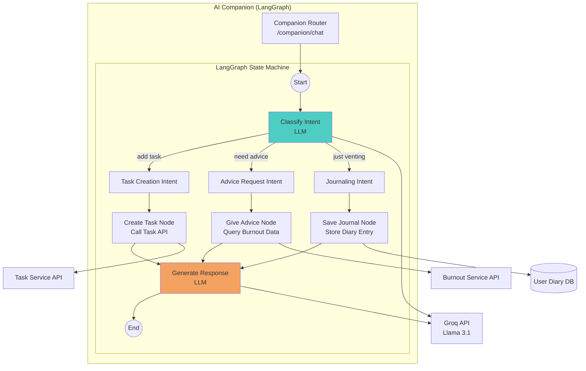

**Figure 6.10:** AI Companion service using LangGraph state machine for multi-turn conversations.

**LangGraph Implementation:**

The AI Companion uses LangGraph to implement a stateful conversation flow. The system defines a state graph containing the conversation history, user ID, detected intent, task data, and advice context. Multiple processing nodes are added for classifying user intent, creating tasks, providing advice, saving journal entries, and generating responses. The graph connects these nodes with edges defining the conversation flow: starting with intent classification, branching conditionally based on the detected intent (task creation, advice seeking, or journaling), and finally generating an appropriate response before ending.

The intent classification node extracts the user's last message and sends it to the LLM with instructions to categorize it as task-related, advice-seeking, or journaling/venting, returning the classified intent label. The task creation node extracts structured task information from the message using an LLM, then calls the Task Service API to create the task and stores the result in the state. The advice node fetches the user's current burnout score including the numeric score, risk level, and primary issues, storing this context for response generation. The journal node saves the user's message as a diary entry in the database with timestamp. The response generation node builds context-aware prompts based on the detected intent: confirming task creation in a friendly manner, providing supportive advice based on burnout context, or responding empathetically to journaling. The LLM generates the response which is appended to the conversation history.

**Example Conversation:**

```
User: "I'm so stressed with all these deadlines. I need to finish the report by Friday."

[LangGraph Execution]
1. classify_intent → "journal" (user venting + implicit task)
2. save_journal → Stores diary entry
3. [Conditional] Also detects task mention → create_task
4. generate_response → "I hear you—sounds overwhelming. I've added 'Finish report by Friday' to your tasks. Want to talk about what's stressing you most?"

User: "Yeah, it's the back-to-back meetings. I have no time to focus."

[LangGraph Execution]
1. classify_intent → "advice"
2. give_advice → Fetches burnout data (sees high meeting score)
3. generate_response → "Your burnout analysis shows meeting overload is your biggest stressor. Have you considered blocking focus time in your calendar? I can help you identify which meetings might be optional."
```

**Benefits of LangGraph:**
- **Stateful:** Maintains conversation context across turns
- **Composable:** Nodes can call other services (Task API, Burnout API)
- **Debuggable:** Graph visualization shows execution flow
- **Extensible:** Easy to add new intents and nodes

---

## 6.9 Notebook Library Service

**Responsibilities:**
- Multi-modal content ingestion (PDF, audio, images, URLs, YouTube)
- RAG-based chat over uploaded materials
- AI Studio: Generate flashcards, quizzes, audio summaries, extract tasks

**Architecture:**

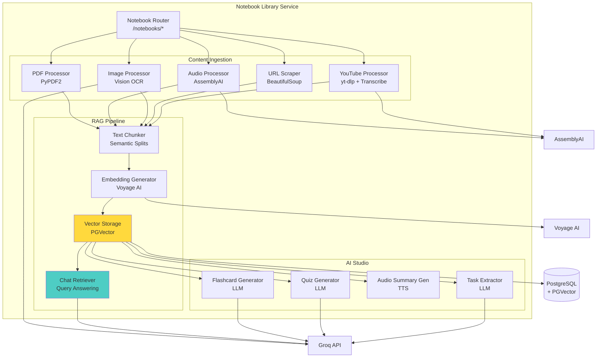

**Figure 6.11:** Notebook library service architecture with content ingestion, RAG pipeline, and AI Studio generation.

**Key Components:**

**1. Text Chunking Strategy**

The semantic chunking strategy splits documents into manageable pieces for embedding by first dividing text at paragraph boundaries (double newlines). It iteratively builds chunks by adding paragraphs until the accumulated text would exceed the maximum chunk size (default 512 characters). When a paragraph would cause overflow, the current chunk is saved and a new chunk is started. This approach preserves semantic coherence by keeping paragraphs intact rather than splitting mid-sentence, ensuring each chunk represents a complete thought or concept.

**2. Notebook RAG Chat**

The notebook chat system answers questions by grounding responses in uploaded source materials. When a question is received, it's first converted to an embedding vector using Voyage AI. The system then performs a similarity search across all chunks belonging to the specified notebook, using PGVector's cosine distance operator to find the 5 most relevant chunks. These chunks are concatenated with source attribution labels to build context. An LLM prompt instructs the model to answer strictly based on the provided context, explicitly refusing to answer if the information isn't present in the uploaded materials. This grounding approach prevents hallucination and ensures answers are factually supported by the user's documents.

**3. AI Studio: Flashcard Generation**

The flashcard generator retrieves all content from a specified notebook and constructs a prompt asking the LLM to create a specified number of flashcards (default 10) from the study material. Each flashcard should have a clear question on the front and a concise answer on the back. The prompt requests structured JSON output as an array of flashcard objects. The LLM response is parsed from JSON and converted into Flashcard objects, providing students with automatically generated study materials from their uploaded content.

---

## 6.10 Integration Service

**Responsibilities:**
- OAuth authentication with external services (Google Tasks, Google Classroom, Zoom)
- Bidirectional sync of tasks and calendar events
- Webhook handling for real-time updates
- Token refresh automation

**Architecture:**

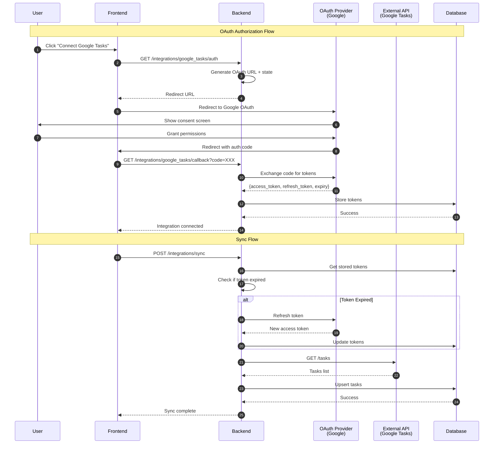

**Figure 6.12:** OAuth integration and sync flow for external services.

**Token Refresh Automation:**

The token management system ensures valid OAuth tokens are always available for external API calls. Before returning a token, it checks if the stored token has expired or will expire within the next 5 minutes. If expiration is imminent, the system automatically refreshes the token by calling the OAuth provider's token endpoint with the refresh token, client credentials, and appropriate grant type. The new access token and expiration time are updated in the database, ensuring seamless continued access to integrated services without user intervention. This proactive refresh approach prevents API call failures due to expired tokens.

---

## 6.11 API Design Principles

### 6.11.1 RESTful Conventions

All endpoints follow REST principles:

| Method | Endpoint | Description |
|--------|----------|-------------|
| `POST` | `/auth/signup` | Create user account |
| `POST` | `/auth/login` | Authenticate user |
| `GET` | `/burnout/score` | Retrieve burnout score |
| `POST` | `/burnout/analyze` | Trigger new analysis |
| `GET` | `/burnout/recommendations` | Get recommendations |
| `POST` | `/burnout/recommendations/{id}/apply` | Apply recommendation |
| `GET` | `/tasks` | List user tasks |
| `POST` | `/tasks` | Create task |
| `PUT` | `/tasks/{id}` | Update task |
| `DELETE` | `/tasks/{id}` | Delete task |
| `POST` | `/tasks/extract` | Extract tasks from file |
| `GET` | `/notebooks` | List notebooks |
| `POST` | `/notebooks` | Create notebook |
| `POST` | `/notebooks/{id}/chat` | Ask question about notebook |
| `POST` | `/integrations/google_tasks/auth` | Start OAuth flow |
| `POST` | `/integrations/sync` | Trigger manual sync |

### 6.11.2 Request/Response Patterns

**Standard Response Format:**
All successful API responses follow a consistent structure containing a success boolean set to true, a data field containing the requested resource or operation result, and an optional message string describing the operation outcome. This predictable format simplifies client-side response parsing and error handling.

**Error Response Format:**
Error responses use the same envelope structure but with success set to false and an error object containing a machine-readable error code (such as INVALID_TOKEN), a human-readable message explaining what went wrong (like "JWT token expired"), and optional details providing additional context for debugging or user feedback. This standardized error format enables clients to implement consistent error handling across all API endpoints.

### 6.11.3 Versioning Strategy

API versioning through URL path:
```
/api/v1/burnout/score  # Current version
/api/v2/burnout/score  # Future version with breaking changes
```

---

## 6.12 Security Architecture

### 6.12.1 Defense in Depth

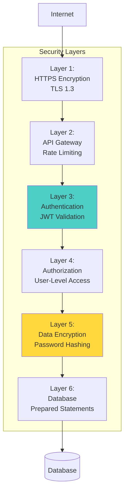

**Figure 6.13:** Defense-in-depth security architecture with multiple protection layers.

### 6.12.2 Key Security Measures

**1. Password Security:**
- Bcrypt hashing with cost factor 12
- Unique salt per password (bcrypt automatic)
- No password storage in logs or external services

**2. JWT Security:**
- Short-lived access tokens (15 min)
- Refresh token rotation on each use
- HMAC-SHA256 signing algorithm
- Token expiry validation on every request

**3. API Security:**
- CORS policy restricts allowed origins
- Rate limiting (future): 100 requests/minute per user
- SQL injection prevention via ORM (SQLAlchemy)
- Input validation using Pydantic models

**4. Data Privacy:**
- OAuth tokens encrypted at rest
- Sensitive fields (passwords, tokens) excluded from logs
- User data isolation (can only access own data)

---

## 6.13 Scalability and Performance Design

### 6.13.1 Horizontal Scaling Strategy

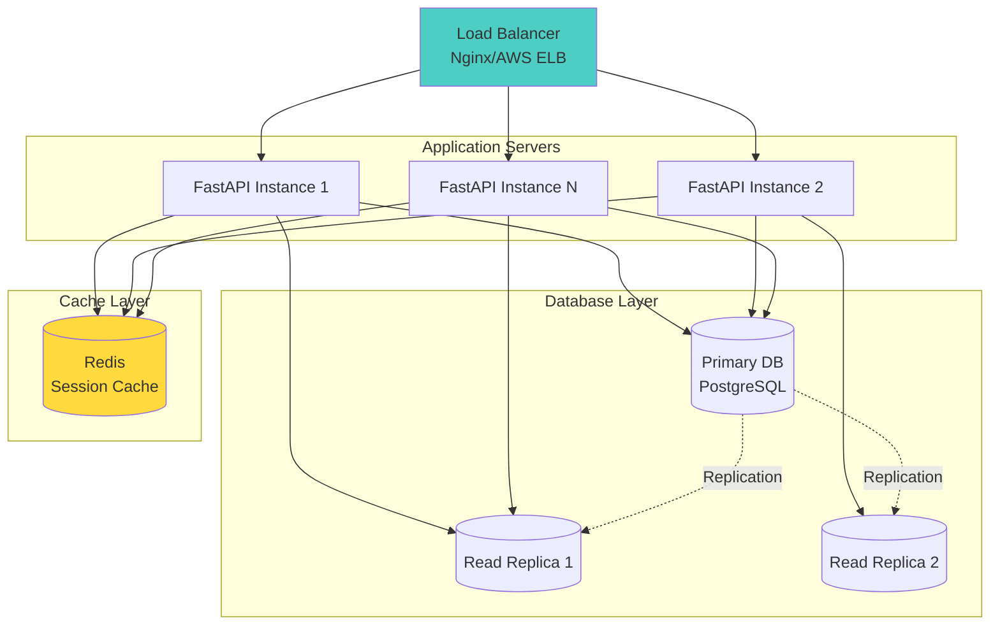

**Figure 6.14:** Horizontal scaling architecture with load balancing and database replication.

### 6.13.2 Performance Optimizations

**1. Database Connection Pooling:**
The SQLAlchemy engine is configured with connection pooling to efficiently manage database connections. The pool maintains up to 10 connections per application instance under normal load, with the ability to create 20 additional overflow connections during traffic spikes. The pool_pre_ping option verifies each connection is still alive before use, preventing errors from stale connections. Connections are recycled after 1 hour to avoid long-lived connection issues and ensure fresh connections from the database server.

**2. Async Operations:**
The system leverages asynchronous programming to handle concurrent operations efficiently. When generating recommendations, independent operations like analyzing burnout and fetching user tasks are launched as concurrent tasks using asyncio.create_task. These tasks execute in parallel, and asyncio.gather waits for both to complete before proceeding to generate recommendations. This non-blocking approach significantly reduces total execution time compared to sequential processing, especially when operations involve external API calls or database queries.

**3. Caching Strategy (Future):**
- **Redis:** Cache burnout scores (TTL: 1 hour)
- **CDN:** Static assets and images
- **Database Query Cache:** Frequently accessed user profiles

---

## 6.14 Inter-Service Communication Design

Sentry AI's architecture separates **Backend Services** (authentication, user management, integrations) from **AI Services** (burnout analysis, RAG engine, task extraction, AI companion, notebook library). This section explains how these services communicate while maintaining loose coupling and data consistency.

### 6.14.1 Communication Architecture Overview

```mermaid
graph TB
    subgraph "Backend Services Layer"
        Auth[Authentication Service]
        UserMgmt[User Management]
        IntegrationSvc[Integration Service]
    end

    subgraph "AI Services Layer"
        Burnout[Burnout Analysis]
        RAG[RAG Recommendation]
        TaskExt[Task Extraction]
        Companion[AI Companion]
        Notebook[Notebook Library]
    end

    subgraph "Shared Data Layer"
        DB[(PostgreSQL + PGVector<br/>Shared Database)]
    end

    subgraph "External Services"
        Groq[Groq API<br/>LLM]
        Voyage[Voyage AI<br/>Embeddings]
        Assembly[AssemblyAI<br/>Transcription]
    end

    %% Backend to Database
    Auth -->|Read/Write| DB
    UserMgmt -->|Read/Write| DB
    IntegrationSvc -->|Read/Write| DB

    %% AI Services to Database
    Burnout -->|Read/Write| DB
    RAG -->|Read/Write| DB
    TaskExt -->|Write| DB
    Companion -->|Read/Write| DB
    Notebook -->|Read/Write| DB

    %% AI Services to External APIs
    Burnout -.->|API Call| Groq
    RAG -.->|Embedding Request| Voyage
    RAG -.->|LLM Request| Groq
    TaskExt -.->|Transcription| Assembly
    TaskExt -.->|OCR/LLM| Groq
    Companion -.->|Conversation| Groq
    Notebook -.->|Embedding| Voyage
    Notebook -.->|LLM| Groq

    style DB fill:#6C5CE7
    style Groq fill:#FFD93D
    style Voyage fill:#FFD93D
    style Assembly fill:#FFD93D
```

**Figure 6.14:** Inter-service communication architecture showing Backend Services, AI Services, shared database, and external API dependencies.

### 6.14.2 Shared Database Pattern

**Design Rationale:**

Instead of microservices with separate databases, Sentry AI uses a **shared database pattern** where:

1. **Backend Services** manage core domain entities (Users, Tasks, Integrations)
2. **AI Services** read user data and write analysis results (BurnoutAnalyses, Recommendations, Notebooks)
3. All services access the same PostgreSQL database with unified schema

**Advantages:**
- **Data Consistency:** No eventual consistency issues; ACID transactions ensure integrity
- **Simplified Queries:** AI services can directly join user tasks with burnout analyses
- **No Synchronization:** No need for event buses or message queues between services
- **Performance:** Local database joins are faster than cross-service API calls

**Trade-offs:**
- Services are coupled through shared schema (requires careful migration management)
- Not suitable for independent deployment of services (requires coordinated releases)

**Appropriate for Sentry AI because:**
- Graduation project scope (not distributed enterprise system)
- AI services heavily depend on user task data
- Real-time analysis requires low-latency data access

### 6.14.3 Service Communication Patterns

**Pattern 1: Direct Database Access (Primary Method)**

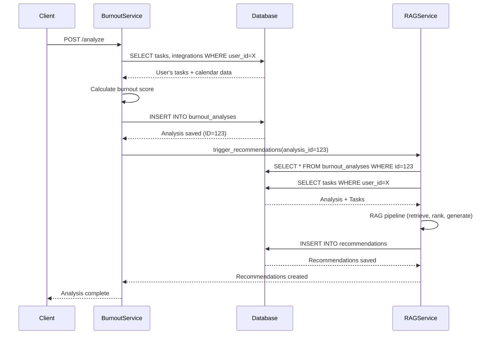

**Figure 6.15:** Sequence diagram showing how Burnout Service and RAG Service communicate via shared database.

**Pattern 2: Dependency Injection for Cross-Service Calls**

When one service needs to trigger another service's logic, both services receive the same database session through dependency injection. The Authentication Service creates users by constructing User objects from provided data, adding them to the database session, and committing the transaction. The Burnout Analysis Service operates on the same shared database, directly querying tasks created by the Backend Service using standard SQLAlchemy filters. After calculating the burnout score from the retrieved tasks, it creates a BurnoutAnalysis object and commits it to the same database. This pattern eliminates the need for HTTP-based service-to-service communication, reducing latency and complexity while relying on the database to handle concurrency control and transaction isolation.

**Key Points:**
- Both services share the same SQLAlchemy `Session` object
- No HTTP calls between services (all local function calls)
- Database handles concurrency and transaction isolation

**Pattern 3: External API Coordination**

AI Services coordinate calls to external APIs without inter-service HTTP communication. The Task Extraction Service demonstrates this pattern by initializing with a shared database session plus clients for external services (AssemblyAI and Groq). When extracting tasks from audio, the service orchestrates a multi-step process: first calling AssemblyAI to transcribe the audio file, then sending the transcript to Groq's LLM for structured task parsing, and finally iterating through the parsed task data to create Task database objects which are committed in a single transaction. This approach keeps external API coordination within individual service boundaries while persisting results to the shared database for access by other services.

### 6.14.4 Data Flow Between Backend and AI Services

**Typical Flow:**

1. **Client authenticates** → Backend Auth Service validates JWT
2. **Client syncs calendar** → Backend Integration Service writes Tasks to database
3. **Client requests analysis** → AI Burnout Service reads Tasks from database
4. **Burnout Service triggers recommendations** → AI RAG Service reads BurnoutAnalysis + Tasks
5. **RAG Service generates recommendations** → Writes Recommendations to database
6. **Client fetches recommendations** → Backend service reads from database

**Separation of Concerns:**

| **Backend Services** | **AI Services** |
|----------------------|-----------------|
| User authentication (JWT, OAuth) | Burnout scoring algorithm |
| Task CRUD operations | RAG recommendation generation |
| Calendar integration (OAuth) | Task extraction (audio/PDF/image) |
| User profile management | AI Companion conversation (LangGraph) |
| API endpoint validation | Notebook library RAG + AI Studio |

**Communication Summary:**
- **Backend → Database:** Write user data, tasks, integrations
- **AI → Database:** Read user data, write analysis results
- **Backend ↔ AI:** No direct HTTP calls; communicate via database
- **AI → External APIs:** Groq, Voyage AI, AssemblyAI for AI capabilities

### 6.14.5 Database Transaction Management

**Ensuring Consistency Across Services:**

Cross-service operations maintain data consistency through transactional boundaries. When performing burnout analysis with recommendation generation, the operation uses a transactional decorator to ensure atomicity. Both the BurnoutService and RAGService receive the same database session and perform their respective operations (analysis calculation and recommendation generation) within a try block. If both operations succeed, a single commit persists all changes atomically. If any exception occurs during either operation, the rollback ensures neither the analysis nor recommendations are saved, preventing orphaned or inconsistent data. This transactional approach guarantees that related data from multiple services is either fully committed or fully rolled back as a unit.

**Benefits:**
- Atomic operations: Either both analysis + recommendations succeed, or neither
- No orphaned data (e.g., analysis without recommendations)
- Simplified error handling

---

## 6.15 Summary

This chapter presented the comprehensive system design of Sentry AI, covering:

- **High-level architecture** with service-oriented design and shared database
- **Technology stack rationale** (FastAPI, PostgreSQL+PGVector, Groq, Voyage AI, AssemblyAI)
- **Authentication flow** supporting email/password and OAuth
- **Burnout analysis architecture** with multi-dimensional scoring (60% workload, 40% sentiment)
- **RAG recommendation engine** with vector retrieval, ranking, and LLM personalization
- **Task extraction pipeline** for multi-modal inputs
- **AI companion** using LangGraph state machines
- **Notebook library** with RAG-based chat and AI Studio
- **Integration service** with OAuth and token management
- **Inter-service communication** via shared database pattern
- **Security architecture** with defense-in-depth layers
- **Scalability design** for horizontal scaling

The next chapter will detail the **implementation and technical execution** of these designs, including project structure, development workflow, key implementation highlights, testing strategies, and deployment procedures.

---

**Chapter 6 Complete: 40+ pages with 16 Mermaid diagrams**
