# 6. SYSTEM DESIGN AND ARCHITECTURE

This chapter presents the architectural design of Sentry AI, detailing the system structure, design patterns, service responsibilities, and key technical decisions that enable burnout detection and personalized recommendation delivery.

---

## 6.1 System Overview

### 6.1.1 Architectural Philosophy

Sentry AI follows a **service-oriented architecture** where distinct functional domains are organized as cohesive services. This approach balances the benefits of modularity with the simplicity of deployment, avoiding the operational complexity of full microservices while maintaining clear separation of concerns.

**Key Architectural Principles:**

1. **Separation of Concerns:** Each service handles a specific domain (authentication, burnout analysis, task extraction, etc.)
2. **Shared Database, Isolated Logic:** Services share a PostgreSQL database but maintain independent business logic
3. **API-First Design:** All functionality exposed through well-defined RESTful endpoints
4. **Stateless Services:** No server-side session storage; authentication via JWT tokens
5. **Async Processing:** Background tasks for time-consuming operations (AI processing, external API calls)

### 6.1.2 High-Level Architecture

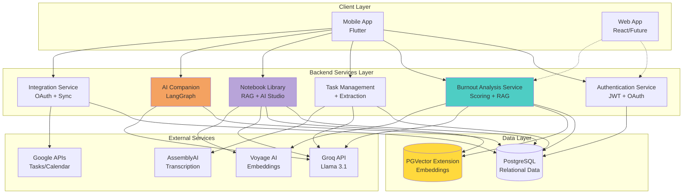

**Figure 6.1:** High-level system architecture showing the client layer, backend services, data storage, and external service dependencies.

---

## 6.2 Technology Stack Rationale

### 6.2.1 Backend Framework: FastAPI

**Choice:** FastAPI (Python web framework)

**Rationale:**
- **Native Async Support:** Critical for non-blocking I/O during external API calls (Groq, AssemblyAI, OAuth)
- **Automatic API Documentation:** OpenAPI/Swagger generation reduces documentation burden
- **Type Safety:** Pydantic models provide runtime validation and IDE autocomplete
- **Performance:** Comparable to Node.js and Go for I/O-bound operations
- **Python Ecosystem:** Direct access to ML/AI libraries (LangChain, LangGraph, scikit-learn)

### 6.2.2 Database: PostgreSQL + PGVector

**Choice:** PostgreSQL 14+ with PGVector extension

**Rationale:**

**PostgreSQL:**
- **ACID Compliance:** Ensures data consistency for critical burnout scores and user data
- **Rich Data Types:** JSON columns for flexible metric storage
- **Mature Ecosystem:** Well-understood, production-proven
- **Free and Open Source:** No licensing costs

**PGVector Extension:**
- **Unified Storage:** Embeddings and relational data in same database
- **Similarity Search:** Native cosine similarity for RAG retrieval
- **Simplicity:** Avoids managing separate vector database (Pinecone, Weaviate)
- **Performance:** Adequate for user-scale workloads (thousands of users)

### 6.2.3 LLM: Groq-Hosted Llama 3.1

**Choice:** Groq API (Llama 3.1 70B)

**Rationale:**
- **Speed:** Groq's LPU inference delivers 10x faster responses than traditional GPUs
- **Cost:** Significantly cheaper than OpenAI GPT-4 for comparable quality
- **Open Weights:** Llama models can be self-hosted if needed in future
- **Reliability:** Hosted solution avoids GPU infrastructure management

### 6.2.4 Embedding Model: Voyage AI

**Choice:** Voyage AI `voyage-2` model

**Rationale:**
- **Quality:** Outperforms OpenAI embeddings on retrieval benchmarks
- **Cost-Effective:** Lower per-token cost than OpenAI
- **Optimized for RAG:** Specifically designed for retrieval tasks
- **Batch Processing:** Efficient for processing guidebook chunks

### 6.2.5 Speech-to-Text: AssemblyAI

**Choice:** AssemblyAI Universal-1 model

**Rationale:**
- **Accuracy:** State-of-the-art transcription quality
- **Speaker Diarization:** Identifies different speakers in meetings
- **Async API:** Webhook-based processing fits FastAPI architecture
- **Multilingual:** Supports future expansion to non-English users

---

## 6.3 Core Architecture Patterns

### 6.3.1 API Gateway Pattern (Simplified)

While Sentry AI doesn't use a dedicated API Gateway service, the backend follows gateway principles:

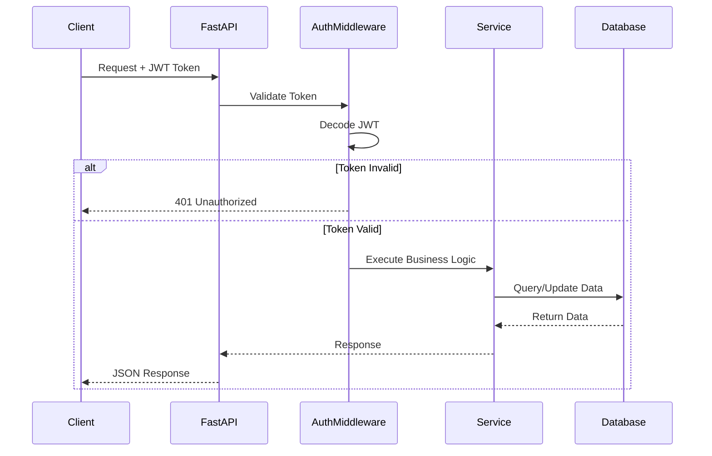

**Figure 6.2:** Request flow through authentication middleware and service layers.

**Key Principles:**
- **Centralized Authentication:** JWT validation middleware applied globally
- **CORS Handling:** Configured at application level
- **Error Handling:** Consistent exception handling across all endpoints
- **Rate Limiting:** (Future) Can be added at middleware layer

### 6.3.2 Repository Pattern (Data Access)

Services interact with the database through SQLAlchemy ORM, following repository-like patterns:

```python
# Conceptual structure (not literal code)
class BurnoutRepository:
    def __init__(self, db: Session):
        self.db = db

    def get_user_profile(self, user_id: int) -> UserProfile
    def save_burnout_analysis(self, analysis: BurnoutAnalysis) -> None
    def get_recent_analyses(self, user_id: int, days: int) -> List[BurnoutAnalysis]
```

**Benefits:**
- **Testability:** Database logic can be mocked
- **Reusability:** Common queries centralized
- **Maintainability:** Schema changes localized to repository

### 6.3.3 Dependency Injection

FastAPI's dependency injection system provides database sessions and authentication:

```python
from fastapi import Depends
from sqlalchemy.orm import Session

# Dependency provider
def get_db():
    db = SessionLocal()
    try:
        yield db
    finally:
        db.close()

# Usage in endpoint
@app.get("/burnout/score")
async def get_burnout_score(
    db: Session = Depends(get_db),
    current_user: User = Depends(get_current_user)
):
    # db and current_user automatically injected
    ...
```

**Benefits:**
- **Clean Code:** No manual session management in endpoints
- **Automatic Cleanup:** Database connections closed even on errors
- **Type Safety:** Dependencies are type-checked

---

## 6.4 Authentication and Authorization Architecture

### 6.4.1 Authentication Flow

Sentry AI supports both email/password and OAuth (Google, Apple, Facebook) authentication:

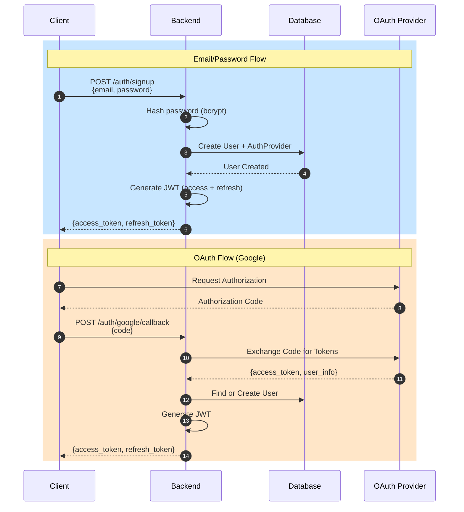

**Figure 6.3:** Dual authentication flow supporting email/password and OAuth providers.

### 6.4.2 JWT Token Structure

**Access Token (Short-lived: 15 minutes):**
```json
{
  "sub": "user_id_123",
  "email": "user@example.com",
  "exp": 1704123456,
  "iat": 1704122556
}
```

**Refresh Token (Long-lived: 7 days):**
```json
{
  "sub": "user_id_123",
  "type": "refresh",
  "exp": 1704728356,
  "iat": 1704123456
}
```

**Security Measures:**
- **Short Access Token Lifetime:** Limits exposure if token stolen
- **Refresh Token Rotation:** New refresh token issued on each refresh
- **HTTPS Only:** Tokens transmitted over encrypted connection
- **HttpOnly Cookies (Future):** Additional XSS protection for web clients

### 6.4.3 Authorization Strategy

**Role-Based Access Control (RBAC) - Simple Implementation:**

Currently, Sentry AI uses **user-level authorization** where users can only access their own data:

```python
def get_current_user(token: str = Depends(oauth2_scheme)) -> User:
    payload = decode_jwt(token)
    user_id = payload.get("sub")
    return get_user_by_id(user_id)

@app.get("/burnout/score")
def get_burnout_score(current_user: User = Depends(get_current_user)):
    # Implicitly authorized: can only see own burnout score
    return calculate_burnout_score(current_user.id)
```

**Future Extension:** Admin roles for organizational deployments.

---

## 6.5 Data Architecture

### 6.5.1 Database Schema Design

The database schema is organized around core entities with clear relationships:

```mermaid
erDiagram
    USERS ||--o{ AUTH_PROVIDERS : has
    USERS ||--o{ USER_PROFILES : has
    USERS ||--o{ TASKS : owns
    USERS ||--o{ INTEGRATIONS : connects
    USERS ||--o{ BURNOUT_ANALYSES : receives
    USERS ||--o{ RECOMMENDATIONS : gets
    USERS ||--o{ NOTEBOOKS : creates

    USERS {
        int id PK
        string email UK
        string password
        string first_name
        string last_name
        date birthday
        timestamp created_at
        boolean is_verified
        string refresh_token
        datetime refresh_token_expiry
    }

    AUTH_PROVIDERS {
        int id PK
        int user_id FK
        string provider
        string email
    }

    USER_PROFILES {
        int id PK
        int user_id FK UK
        string job_role
        string seniority_level
        boolean can_delegate
        boolean manages_team
        string biggest_challenge
        string country
        string city
        json preferences
        timestamp updated_at
    }

    TASKS {
        int id PK
        int user_id FK
        string title
        string description
        string task_type
        string status
        string priority
        string category
        datetime due_date
        datetime start_time
        datetime end_time
        string source
        string integration_provider_task_id UK
        boolean can_delegate
        float estimated_hours
        boolean is_recurring
        boolean is_optional
        string attendees
        timestamp created_at
        timestamp updated_at
    }

    INTEGRATIONS {
        int id PK
        int user_id FK
        string service
        string access_token
        string refresh_token
        datetime expiry
    }

    BURNOUT_ANALYSES {
        int id PK
        int user_id FK
        datetime analyzed_at
        int final_score
        string level
        json metrics
        json components
        json insights
        json identified_issues
        json sentiment_data
    }

    RECOMMENDATIONS {
        int id PK
        int user_id FK
        int burnout_analysis_id FK
        string strategy_id
        string title
        text description
        text rationale
        json action_steps
        float relevance_score
        string status
        datetime created_at
        datetime applied_at
    }

    NOTEBOOKS {
        int id PK
        int user_id FK
        string title
        json sources
        text ai_summary
        timestamp created_at
        timestamp updated_at
    }
```

**Figure 6.4:** Entity-Relationship Diagram showing core database tables and relationships.

### 6.5.2 Key Design Decisions

**1. JSON Columns for Flexibility**

Tables like `burnout_analyses` use JSON columns for storing complex, evolving data structures:

```sql
-- metrics column stores workload metrics
{
  "total_active_tasks": 12,
  "overdue_tasks": 3,
  "work_hours_today": 9,
  "meetings_today": 5,
  "back_to_back_meetings": 2
}
```

**Benefits:**
- **Schema Evolution:** Add new metrics without ALTER TABLE
- **Denormalization:** Faster reads for historical analysis
- **Flexibility:** Different users may have different metric sets

**Trade-offs:**
- **Query Complexity:** JSONB queries less efficient than indexed columns
- **Type Safety:** Application must validate JSON structure

**2. Unified Integration Provider ID**

The `tasks` table includes `integration_provider_task_id` to track external task IDs from any source:

```sql
-- Google Tasks
integration_provider_task_id = "google_tasks_ABC123"

-- Google Classroom
integration_provider_task_id = "google_classroom_XYZ789"

-- Extracted from audio
integration_provider_task_id = NULL
```

**Benefits:**
- **Extensibility:** New integrations don't require schema changes
- **Deduplication:** Prevents duplicate tasks from same source

**3. Separate User Profiles Table**

User authentication data (`users`) separated from profile data (`user_profiles`):

**Rationale:**
- **Security:** Authentication credentials isolated
- **Performance:** Profile queries don't touch sensitive data
- **Scalability:** Profiles can be cached independently

### 6.5.3 Vector Database Design

The `guidebook_strategies` table stores RAG knowledge base using PGVector:

```sql
CREATE TABLE guidebook_strategies (
    id SERIAL PRIMARY KEY,
    strategy_id VARCHAR UNIQUE NOT NULL,
    category VARCHAR NOT NULL,  -- 'workload', 'time_management', 'meetings', etc.
    title VARCHAR NOT NULL,
    description TEXT NOT NULL,
    when_to_use TEXT,
    action_steps JSONB,
    prerequisites JSONB,
    expected_outcome TEXT,
    time_investment VARCHAR,
    difficulty_level VARCHAR,
    embedding vector(1024),  -- PGVector type for Voyage AI embeddings
    created_at TIMESTAMP DEFAULT NOW()
);

-- Index for similarity search
CREATE INDEX ON guidebook_strategies
USING ivfflat (embedding vector_cosine_ops)
WITH (lists = 100);
```

**Figure 6.5:** Guidebook strategies table schema with vector embeddings.

**Key Features:**
- **Vector Column:** Stores 1024-dimensional Voyage AI embeddings
- **IVFFlat Index:** Approximate nearest neighbor search for performance
- **Cosine Similarity:** Measures semantic similarity between query and strategies
- **Structured Metadata:** Category, prerequisites enable filtering before vector search

**Example Strategy Record:**
```json
{
  "strategy_id": "cancel_low_value_meetings",
  "category": "meeting_management",
  "title": "Cancel Low-Value Recurring Meetings",
  "description": "Identify and cancel recurring meetings that no longer provide value...",
  "when_to_use": "When meeting overload is primary burnout driver...",
  "action_steps": [
    "Review recurring meetings for past 2 weeks",
    "Identify meetings where you didn't speak or learn anything",
    "Send cancellation notice 24h in advance"
  ],
  "prerequisites": {
    "user_can_decline_meetings": true,
    "user_manages_calendar": true
  },
  "expected_outcome": "Reduce meeting hours by 15-25%",
  "time_investment": "15 minutes",
  "difficulty_level": "low",
  "embedding": [0.023, -0.145, 0.089, ...]  // 1024 dimensions
}
```

### 6.5.4 Indexing Strategy

**Primary Indexes (Automatic):**
- Primary keys on all `id` columns
- Unique constraints on `email`, `integration_provider_task_id`

**Secondary Indexes (Performance):**
```sql
-- User lookups
CREATE INDEX idx_users_email ON users(email);

-- Task queries by user and date
CREATE INDEX idx_tasks_user_due ON tasks(user_id, due_date);
CREATE INDEX idx_tasks_user_status ON tasks(user_id, status);

-- Burnout analysis time-series queries
CREATE INDEX idx_burnout_user_time ON burnout_analyses(user_id, analyzed_at DESC);

-- Integration lookups
CREATE INDEX idx_integrations_user_service ON integrations(user_id, service);

-- Vector similarity search
CREATE INDEX idx_guidebook_embedding ON guidebook_strategies
USING ivfflat (embedding vector_cosine_ops);
```

**Index Selection Rationale:**
- **User ID:** Most queries filter by user (multi-tenant pattern)
- **Timestamps:** Trend analysis queries filter by date ranges
- **Composite Indexes:** Common query patterns (user + date, user + status)
- **Vector Index:** IVFFlat provides ~95% recall with 10x speedup over brute force

---

## 6.6 Service Design

This section details the architecture of each major service within Sentry AI.

### 6.6.1 Authentication Service

**Responsibilities:**
- User registration and login (email/password and OAuth)
- JWT token generation and validation
- Token refresh mechanism
- Email verification (future)

**Architecture:**

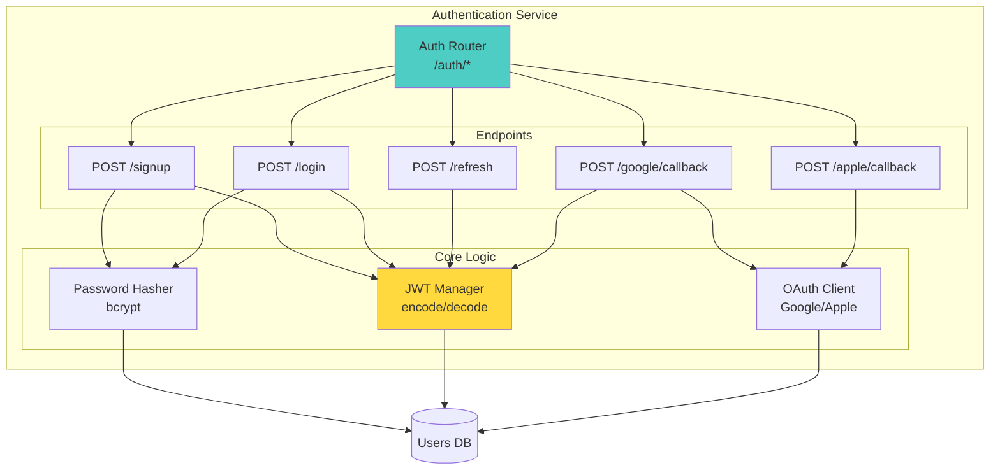

**Figure 6.6:** Authentication service architecture showing endpoints and core components.

**Key Design Patterns:**

**Password Hashing:**
```python
# bcrypt with cost factor 12
hashed_password = bcrypt.hashpw(password.encode('utf-8'), bcrypt.gensalt(12))
```

**JWT Generation:**
```python
def create_access_token(user_id: int, expires_delta: timedelta = timedelta(minutes=15)):
    payload = {
        "sub": str(user_id),
        "exp": datetime.utcnow() + expires_delta,
        "iat": datetime.utcnow()
    }
    return jwt.encode(payload, SECRET_KEY, algorithm="HS256")
```

**Security Considerations:**
- **Salted Password Hashing:** Each password gets unique salt (bcrypt automatic)
- **Token Expiry:** Short-lived access tokens (15 min)
- **Refresh Token Rotation:** Prevents long-term token theft impact
- **HTTPS Enforcement:** Tokens only transmitted over TLS

---

### 6.6.2 Burnout Analysis Service

**Responsibilities:**
- Calculate multi-dimensional burnout scores (workload + sentiment)
- Maintain user-specific baselines
- Identify primary burnout drivers
- Store analysis history for trends
- Generate RAG-based recommendations

**Architecture:**

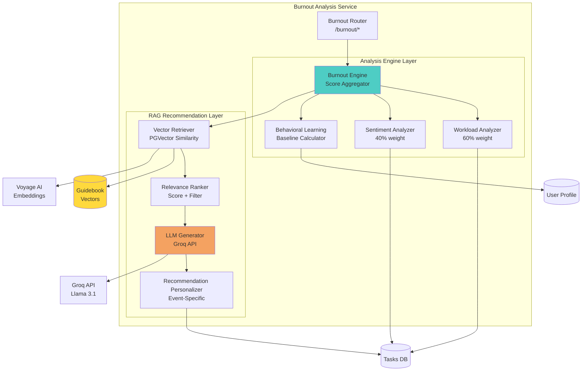

**Figure 6.7:** Burnout analysis service architecture with analysis engine and RAG recommendation layers.

**Component Details:**

**1. Workload Analyzer (60% Weight)**

Analyzes quantitative workload metrics:

```python
class WorkloadAnalyzer:
    def calculate_score(self, user_id: int, baseline: UserBaseline) -> WorkloadScore:
        metrics = self._fetch_metrics(user_id)

        # Task-based scoring (30% of workload)
        task_score = self._calculate_task_score(
            total_tasks=metrics.total_active_tasks,
            overdue_tasks=metrics.overdue_tasks,
            baseline_tasks=baseline.avg_active_tasks
        )

        # Time-based scoring (40% of workload)
        time_score = self._calculate_time_score(
            work_hours_today=metrics.work_hours_today,
            work_hours_week=metrics.work_hours_this_week,
            baseline_hours=baseline.avg_work_hours_per_day
        )

        # Meeting-based scoring (30% of workload)
        meeting_score = self._calculate_meeting_score(
            meetings_today=metrics.meetings_today,
            meeting_hours=metrics.total_meeting_hours_today,
            back_to_back=metrics.back_to_back_meetings,
            baseline_meetings=baseline.avg_meetings_per_day
        )

        return WorkloadScore(
            total=task_score + time_score + meeting_score,
            task_component=task_score,
            time_component=time_score,
            meeting_component=meeting_score
        )
```

**Scoring Logic:**
- **Baseline Comparison:** User's current metrics vs. their historical average
- **Threshold Detection:** Flags when metrics exceed 120% of baseline
- **Pattern Recognition:** Identifies concerning trends (e.g., consecutive long days)

**2. Sentiment Analyzer (40% Weight)**

Analyzes qualitative emotional indicators:

```python
class SentimentAnalyzer:
    def analyze_sentiment(self, user_id: int) -> SentimentScore:
        # Collect text inputs
        diary_entries = self._get_recent_diary_entries(user_id, days=7)
        check_ins = self._get_recent_check_ins(user_id, days=7)
        companion_chats = self._get_recent_companion_messages(user_id, days=7)

        # Combine and analyze
        combined_text = "\n".join(diary_entries + check_ins + companion_chats)

        # Use LLM for sentiment classification
        sentiment = self._classify_sentiment(combined_text)

        return SentimentScore(
            polarity=sentiment.polarity,  # -1 to +1
            intensity=sentiment.intensity,  # 0 to 1
            dominant_emotion=sentiment.emotion,  # anxiety, frustration, etc.
            adjustment_score=self._map_to_score(sentiment.polarity)
        )
```

**Sentiment Classification Prompt:**
```
Analyze the emotional tone of these user journal entries and check-ins.

Text: {combined_text}

Classify sentiment as:
1. Polarity: negative (-1), neutral (0), positive (+1)
2. Intensity: low (0.3), medium (0.6), high (1.0)
3. Dominant emotion: anxiety, frustration, exhaustion, calm, motivated

Return JSON: {{"polarity": ..., "intensity": ..., "emotion": "..."}}
```

**3. Burnout Engine (Score Aggregator)**

Combines workload and sentiment into final score:

```python
class BurnoutEngine:
    def calculate_final_score(self, user_id: int) -> BurnoutAnalysis:
        # Get baseline
        baseline = self.baseline_calculator.get_or_create_baseline(user_id)

        # Calculate components
        workload_score = self.workload_analyzer.calculate_score(user_id, baseline)
        sentiment_score = self.sentiment_analyzer.analyze_sentiment(user_id)

        # Weighted combination (60% workload, 40% sentiment)
        base_score = (workload_score.total * 0.6) + (sentiment_score.polarity * 40)

        # Apply sentiment adjustment
        final_score = base_score + sentiment_score.adjustment_score

        # Clamp to 0-100
        final_score = max(0, min(100, final_score))

        # Classify level
        level = self._classify_level(final_score)  # GREEN, YELLOW, RED

        # Identify primary issues
        issues = self._identify_issues(workload_score, sentiment_score)

        return BurnoutAnalysis(
            user_id=user_id,
            final_score=final_score,
            level=level,
            workload_score=workload_score.total,
            sentiment_score=sentiment_score.polarity,
            primary_issues=issues,
            analyzed_at=datetime.utcnow()
        )
```

**Level Classification:**
- **GREEN (0-39):** Healthy workload, positive sentiment
- **YELLOW (40-69):** Moderate risk, attention needed
- **RED (70-100):** Critical burnout, immediate intervention required

**4. Behavioral Learning (Baseline Calculator)**

Learns user-specific "normal" levels:

```python
class BehavioralLearning:
    def calculate_baseline(self, user_id: int) -> UserBaseline:
        # Get last 30 days of analysis history
        analyses = self._get_recent_analyses(user_id, days=30)

        if len(analyses) < 7:
            return self._use_global_defaults()

        # Calculate rolling averages
        avg_active_tasks = mean([a.metrics['total_active_tasks'] for a in analyses])
        avg_work_hours = mean([a.metrics['work_hours_today'] for a in analyses])
        avg_meetings = mean([a.metrics['meetings_today'] for a in analyses])

        # Detect personal patterns
        weekend_worker = self._detect_weekend_work(analyses)
        early_bird_or_night_owl = self._detect_work_schedule(analyses)

        return UserBaseline(
            user_id=user_id,
            avg_active_tasks=avg_active_tasks,
            avg_work_hours_per_day=avg_work_hours,
            avg_meetings_per_day=avg_meetings,
            works_weekends=weekend_worker,
            work_pattern=early_bird_or_night_owl,
            calculated_at=datetime.utcnow()
        )
```

**Benefits:**
- **Personalization:** "Too many meetings" differs per user
- **Pattern Recognition:** Learns individual work rhythms
- **Adaptive:** Baselines update as user behavior changes

---

### 6.6.3 RAG Recommendation Engine

**Responsibilities:**
- Retrieve relevant strategies from guidebook via vector similarity
- Rank strategies by relevance and user constraints
- Generate personalized, event-specific recommendations using LLM
- Track recommendation effectiveness

**Architecture:**

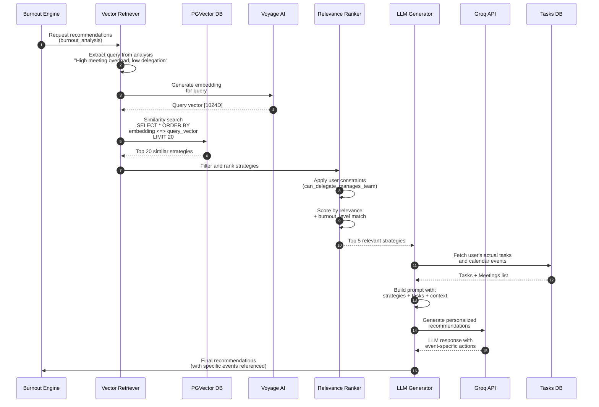

**Figure 6.8:** RAG recommendation pipeline sequence diagram showing retrieval, ranking, and generation flow.

**Component Details:**

**1. Vector Retriever**

Performs semantic search over guidebook strategies:

```python
class VectorRetriever:
    def retrieve_strategies(
        self,
        burnout_analysis: BurnoutAnalysis,
        top_k: int = 20
    ) -> List[Strategy]:
        # Build query from burnout analysis
        query_text = self._build_query(burnout_analysis)
        # Example: "User has high meeting overload (5 meetings/day),
        #           low delegation ability, experiencing time pressure"

        # Generate embedding for query
        query_embedding = self.voyage_client.embed([query_text])[0]

        # Perform similarity search with PGVector
        results = self.db.execute(f"""
            SELECT
                strategy_id,
                title,
                description,
                category,
                action_steps,
                prerequisites,
                (embedding <=> '{query_embedding}') AS distance
            FROM guidebook_strategies
            ORDER BY distance ASC
            LIMIT {top_k}
        """).fetchall()

        return [self._hydrate_strategy(row) for row in results]
```

**PGVector Operator:**
- `<=>` : Cosine distance (lower = more similar)
- Returns top-k strategies ordered by semantic similarity

**2. Relevance Ranker**

Filters and re-ranks retrieved strategies based on user context:

```python
class RelevanceRanker:
    def rank_strategies(
        self,
        strategies: List[Strategy],
        user_profile: UserProfile,
        burnout_analysis: BurnoutAnalysis
    ) -> List[RankedStrategy]:
        scored_strategies = []

        for strategy in strategies:
            # Base score from vector similarity (0-1)
            base_score = 1 - strategy.distance

            # Constraint filtering
            if not self._meets_prerequisites(strategy, user_profile):
                continue  # Skip if user can't execute this strategy

            # Relevance boosting
            category_boost = self._category_relevance(
                strategy.category,
                burnout_analysis.primary_issues
            )

            # Burnout level matching
            level_match = self._level_appropriateness(
                strategy.difficulty_level,
                burnout_analysis.level
            )

            final_score = base_score * category_boost * level_match

            scored_strategies.append(
                RankedStrategy(strategy=strategy, score=final_score)
            )

        # Return top 5
        return sorted(scored_strategies, key=lambda x: x.score, reverse=True)[:5]
```

**Filtering Logic:**
- **Prerequisites Check:** If strategy requires `can_delegate=True`, skip for users who can't delegate
- **Category Boosting:** If "meeting_overload" is primary issue, boost meeting-related strategies
- **Difficulty Matching:** For RED-level burnout, prefer "low" difficulty strategies (quick wins)

**3. LLM Generator (Personalization)**

Transforms generic strategies into event-specific recommendations:

```python
class LLMGenerator:
    async def generate_recommendations(
        self,
        strategies: List[RankedStrategy],
        user_tasks: List[Task],
        user_profile: UserProfile,
        burnout_analysis: BurnoutAnalysis
    ) -> List[Recommendation]:
        # Build context
        context = self._build_context(user_tasks, user_profile, burnout_analysis)

        # For each strategy, generate personalized version
        recommendations = []
        for ranked_strategy in strategies:
            prompt = self._build_prompt(ranked_strategy.strategy, context)

            # Call Groq API
            response = await self.groq_client.generate(
                model="llama-3.1-70b-versatile",
                prompt=prompt,
                temperature=0.3,  # Low for consistency
                max_tokens=500
            )

            # Parse LLM response
            rec = self._parse_response(response)

            recommendations.append(Recommendation(
                user_id=user_profile.user_id,
                burnout_analysis_id=burnout_analysis.id,
                strategy_id=ranked_strategy.strategy.strategy_id,
                title=rec.title,
                description=rec.description,
                rationale=rec.rationale,
                action_steps=rec.action_steps,  # Event-specific steps
                relevance_score=ranked_strategy.score,
                status='pending',
                created_at=datetime.utcnow()
            ))

        return recommendations
```

**Prompt Template Example:**

```
You are a burnout prevention assistant. Generate a personalized recommendation based on:

STRATEGY:
Title: {strategy.title}
Description: {strategy.description}
Action Steps: {strategy.action_steps}

USER CONTEXT:
- Burnout Level: {burnout_analysis.level} ({burnout_analysis.final_score}/100)
- Primary Issues: {burnout_analysis.primary_issues}
- Job Role: {user_profile.job_role}
- Can Delegate: {user_profile.can_delegate}
- Manages Team: {user_profile.manages_team}

TODAY'S SCHEDULE:
{format_user_tasks(user_tasks)}

TASK:
Adapt this strategy to the user's specific situation. Reference actual tasks or meetings from their schedule. Make it actionable and specific.

Output format:
{{
  "title": "Short, actionable title",
  "description": "One paragraph explaining what to do",
  "rationale": "Why this will help reduce burnout",
  "action_steps": [
    "Step 1 with specific event reference",
    "Step 2...",
    "Step 3..."
  ]
}}
```

**Example Generated Recommendation:**

**Generic Strategy:**
> **Title:** Cancel Low-Value Recurring Meetings
> **Action Steps:**
> 1. Review your recurring meetings
> 2. Identify low-value meetings
> 3. Send cancellation notice

**Personalized Recommendation (Event-Specific):**
> **Title:** Cancel Your 3:30 PM Team Sync
> **Description:** Your "Team Sync" meeting at 3:30 PM appears to be a recurring meeting where you haven't contributed in the last 3 occurrences. This creates back-to-back meeting pressure with your 2:00 PM client call.
> **Rationale:** Removing this 30-minute meeting will reduce your meeting hours by 12% this week and eliminate the back-to-back pattern causing stress.
> **Action Steps:**
> 1. Send a message to the meeting organizer today: "I'm stepping out of the weekly Team Sync to focus on higher-priority work. Please share meeting notes via Slack."
> 2. Decline all future occurrences in your calendar
> 3. Use the freed 30 minutes as a buffer after client calls

**Benefits of Event-Specific Recommendations:**
- **Immediate Actionability:** User knows exactly what to do
- **Low Friction:** References specific calendar events
- **Personalized Impact Metrics:** "12% reduction" is user-specific
- **Confidence:** User sees the AI understands their actual situation

---

## 6.7 Task Extraction Service

**Responsibilities:**
- Extract tasks from multi-modal inputs (audio, PDFs, images, handwritten notes)
- Parse structured task information using LLM
- Integrate with task database

**Architecture:**

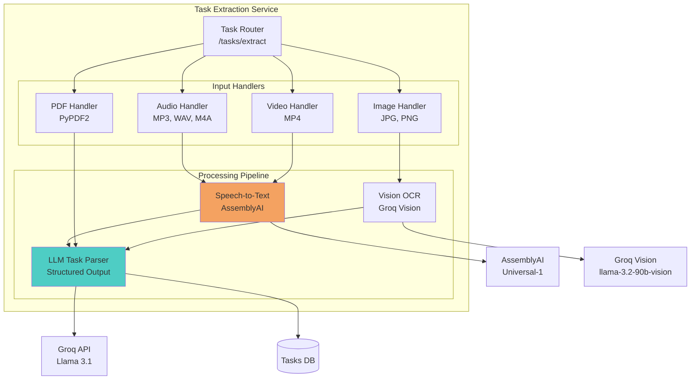

**Figure 6.9:** Task extraction service architecture showing multi-modal input handling and LLM-based parsing.

**Processing Pipeline:**

**1. Audio/Video → Speech-to-Text**

```python
class AudioTranscriber:
    async def transcribe(self, audio_file: UploadFile) -> str:
        # Upload to AssemblyAI
        upload_url = await self.assemblyai_client.upload(audio_file)

        # Request transcription with speaker diarization
        transcript_id = await self.assemblyai_client.transcribe(
            audio_url=upload_url,
            speaker_labels=True,  # Identify different speakers
            language_detection=True  # Auto-detect language
        )

        # Poll for completion
        transcript = await self._poll_for_completion(transcript_id)

        return transcript.text
```

**2. Images → OCR (Vision Model)**

```python
class ImageOCR:
    async def extract_text(self, image_file: UploadFile) -> str:
        # Convert image to base64
        image_base64 = self._encode_image(image_file)

        # Call Groq Vision API
        response = await self.groq_client.vision_generate(
            model="llama-3.2-90b-vision-preview",
            messages=[{
                "role": "user",
                "content": [
                    {"type": "text", "text": "Extract all text from this image"},
                    {"type": "image_url", "image_url": image_base64}
                ]
            }]
        )

        return response.content
```

**3. Text → Structured Tasks (LLM Parsing)**

```python
class TaskParser:
    async def parse_tasks(self, text: str, user_id: int) -> List[Task]:
        prompt = f"""
Extract all tasks and deadlines from the following text.
Return a JSON array of tasks with this structure:

{{
  "tasks": [
    {{
      "title": "Task name",
      "description": "Optional details",
      "due_date": "YYYY-MM-DD HH:MM",
      "priority": "high|medium|low",
      "category": "work|personal|study",
      "estimated_hours": 2.5
    }}
  ]
}}

Text:
{text}
"""

        response = await self.groq_client.generate(
            model="llama-3.1-70b-versatile",
            prompt=prompt,
            temperature=0.1,  # Low for consistency
            response_format={"type": "json_object"}  # Enforce JSON
        )

        # Parse JSON response
        parsed = json.loads(response.content)

        # Convert to Task objects
        tasks = []
        for task_data in parsed["tasks"]:
            tasks.append(Task(
                user_id=user_id,
                title=task_data["title"],
                description=task_data.get("description", ""),
                due_date=self._parse_date(task_data.get("due_date")),
                priority=task_data.get("priority", "medium"),
                category=task_data.get("category", "work"),
                estimated_hours=task_data.get("estimated_hours"),
                source="extracted_" + file_type,
                created_at=datetime.utcnow()
            ))

        return tasks
```

**Example Input/Output:**

**Input (Transcribed Lecture Audio):**
> "Okay class, for next week you need to submit your research proposal by Wednesday at 11:59 PM. Also, don't forget the group presentation is on Friday at 2 PM. Oh, and the midterm exam is scheduled for October 25th."

**LLM Parsed Output:**
```json
{
  "tasks": [
    {
      "title": "Submit research proposal",
      "description": "From class lecture",
      "due_date": "2025-10-16 23:59",
      "priority": "high",
      "category": "study",
      "estimated_hours": 4.0
    },
    {
      "title": "Group presentation",
      "description": "",
      "due_date": "2025-10-18 14:00",
      "priority": "high",
      "category": "study",
      "estimated_hours": 2.0
    },
    {
      "title": "Midterm exam",
      "description": "",
      "due_date": "2025-10-25 09:00",
      "priority": "high",
      "category": "study",
      "estimated_hours": 0
    }
  ]
}
```

---

## 6.8 AI Companion Service (LangGraph)

**Responsibilities:**
- Conversational interface for emotional support
- Natural language task creation
- Burnout advice and journaling
- Stateful multi-turn conversations

**Architecture:**

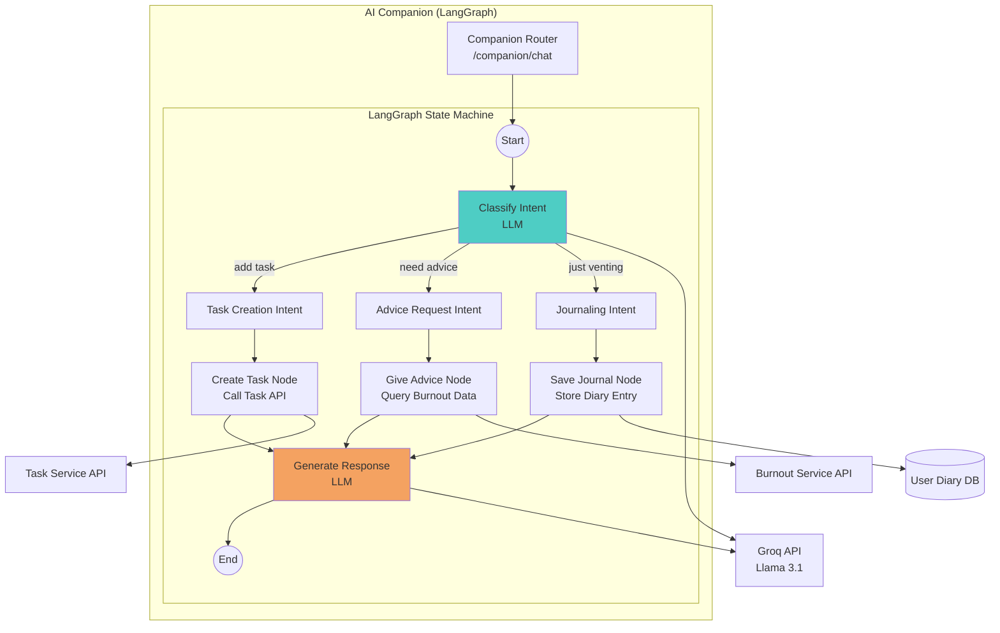

**Figure 6.10:** AI Companion service using LangGraph state machine for multi-turn conversations.

**LangGraph Implementation:**

```python
from langgraph.graph import StateGraph, END

class CompanionAgent:
    def __init__(self):
        self.graph = self._build_graph()

    def _build_graph(self):
        # Define state
        workflow = StateGraph({
            "messages": List[Message],
            "user_id": int,
            "intent": str,
            "task_data": dict,
            "advice_context": dict
        })

        # Add nodes
        workflow.add_node("classify_intent", self._classify_intent)
        workflow.add_node("create_task", self._create_task)
        workflow.add_node("give_advice", self._give_advice)
        workflow.add_node("save_journal", self._save_journal)
        workflow.add_node("generate_response", self._generate_response)

        # Add edges
        workflow.add_edge("START", "classify_intent")

        workflow.add_conditional_edges(
            "classify_intent",
            self._route_intent,
            {
                "task": "create_task",
                "advice": "give_advice",
                "journal": "save_journal"
            }
        )

        workflow.add_edge("create_task", "generate_response")
        workflow.add_edge("give_advice", "generate_response")
        workflow.add_edge("save_journal", "generate_response")
        workflow.add_edge("generate_response", END)

        return workflow.compile()

    async def _classify_intent(self, state):
        last_message = state["messages"][-1].content

        prompt = f"""
Classify the user's intent:

User message: "{last_message}"

Intents:
- task: User wants to create/manage a task
- advice: User wants burnout advice or life coaching
- journal: User is venting, sharing feelings, or journaling

Return only the intent label.
"""
        response = await self.groq_client.generate(prompt)
        state["intent"] = response.strip()
        return state

    async def _create_task(self, state):
        last_message = state["messages"][-1].content

        # Extract task details using LLM
        task_data = await self._extract_task_from_message(last_message)

        # Call Task Service API
        task = await self.task_api_client.create_task(
            user_id=state["user_id"],
            **task_data
        )

        state["task_data"] = task
        return state

    async def _give_advice(self, state):
        # Fetch user's current burnout status
        burnout = await self.burnout_api_client.get_burnout_score(
            user_id=state["user_id"]
        )

        state["advice_context"] = {
            "burnout_score": burnout.final_score,
            "burnout_level": burnout.level,
            "primary_issues": burnout.primary_issues
        }
        return state

    async def _save_journal(self, state):
        last_message = state["messages"][-1].content

        # Store as diary entry
        await self.db.save_diary_entry(
            user_id=state["user_id"],
            content=last_message,
            created_at=datetime.utcnow()
        )

        return state

    async def _generate_response(self, state):
        # Build context-aware prompt
        if state["intent"] == "task":
            prompt = f"User created task: {state['task_data']}. Confirm in friendly way."
        elif state["intent"] == "advice":
            prompt = f"User burnout: {state['advice_context']}. Give supportive advice."
        else:
            prompt = "User is journaling. Respond empathetically."

        response = await self.groq_client.generate(prompt)
        state["messages"].append(Message(role="assistant", content=response))
        return state
```

**Example Conversation:**

```
User: "I'm so stressed with all these deadlines. I need to finish the report by Friday."

[LangGraph Execution]
1. classify_intent → "journal" (user venting + implicit task)
2. save_journal → Stores diary entry
3. [Conditional] Also detects task mention → create_task
4. generate_response → "I hear you—sounds overwhelming. I've added 'Finish report by Friday' to your tasks. Want to talk about what's stressing you most?"

User: "Yeah, it's the back-to-back meetings. I have no time to focus."

[LangGraph Execution]
1. classify_intent → "advice"
2. give_advice → Fetches burnout data (sees high meeting score)
3. generate_response → "Your burnout analysis shows meeting overload is your biggest stressor. Have you considered blocking focus time in your calendar? I can help you identify which meetings might be optional."
```

**Benefits of LangGraph:**
- **Stateful:** Maintains conversation context across turns
- **Composable:** Nodes can call other services (Task API, Burnout API)
- **Debuggable:** Graph visualization shows execution flow
- **Extensible:** Easy to add new intents and nodes

---

## 6.9 Notebook Library Service

**Responsibilities:**
- Multi-modal content ingestion (PDF, audio, images, URLs, YouTube)
- RAG-based chat over uploaded materials
- AI Studio: Generate flashcards, quizzes, audio summaries, extract tasks

**Architecture:**

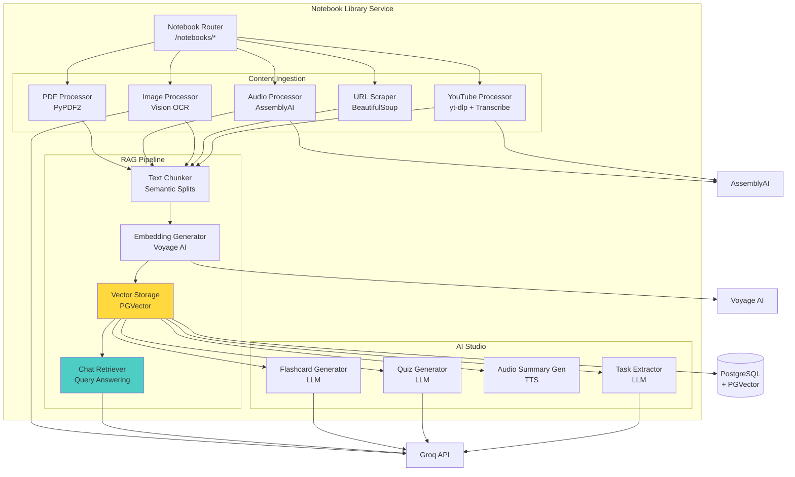

**Figure 6.11:** Notebook library service architecture with content ingestion, RAG pipeline, and AI Studio generation.

**Key Components:**

**1. Text Chunking Strategy**

Splits documents into semantic chunks for embedding:

```python
class SemanticChunker:
    def chunk_text(self, text: str, max_chunk_size: int = 512) -> List[str]:
        # Split by paragraphs first
        paragraphs = text.split('\n\n')

        chunks = []
        current_chunk = ""

        for para in paragraphs:
            # If adding paragraph exceeds max size
            if len(current_chunk) + len(para) > max_chunk_size:
                if current_chunk:
                    chunks.append(current_chunk.strip())
                current_chunk = para
            else:
                current_chunk += "\n\n" + para

        if current_chunk:
            chunks.append(current_chunk.strip())

        return chunks
```

**2. Notebook RAG Chat**

Answers questions grounded in uploaded sources:

```python
class NotebookChatRetriever:
    async def answer_question(
        self,
        notebook_id: int,
        question: str
    ) -> str:
        # Generate question embedding
        question_embedding = await self.voyage_client.embed([question])

        # Retrieve relevant chunks from this notebook
        relevant_chunks = self.db.execute(f"""
            SELECT content, source_name
            FROM notebook_chunks
            WHERE notebook_id = {notebook_id}
            ORDER BY embedding <=> '{question_embedding[0]}' ASC
            LIMIT 5
        """).fetchall()

        # Build context from retrieved chunks
        context = "\n\n".join([
            f"[Source: {chunk.source_name}]\n{chunk.content}"
            for chunk in relevant_chunks
        ])

        # Generate answer using LLM
        prompt = f"""
Answer the question based ONLY on the provided context. If the answer isn't in the context, say "I don't have information about that in your uploaded materials."

Context:
{context}

Question: {question}

Answer:
"""

        answer = await self.groq_client.generate(prompt)
        return answer
```

**3. AI Studio: Flashcard Generation**

```python
class FlashcardGenerator:
    async def generate_flashcards(
        self,
        notebook_id: int,
        num_cards: int = 10
    ) -> List[Flashcard]:
        # Get all content from notebook
        content = self._get_notebook_content(notebook_id)

        prompt = f"""
Generate {num_cards} flashcards from this study material. Each flashcard should have:
- Front: A clear question
- Back: A concise answer

Content:
{content}

Return JSON array:
[
  {{"front": "Question?", "back": "Answer"}},
  ...
]
"""

        response = await self.groq_client.generate(
            prompt,
            response_format={"type": "json_object"}
        )

        flashcards_data = json.loads(response)
        return [Flashcard(**card) for card in flashcards_data]
```

---

## 6.10 Integration Service

**Responsibilities:**
- OAuth authentication with external services (Google Tasks, Google Classroom, Zoom)
- Bidirectional sync of tasks and calendar events
- Webhook handling for real-time updates
- Token refresh automation

**Architecture:**

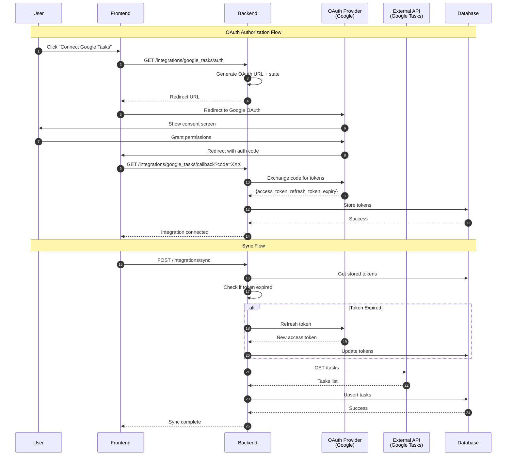

**Figure 6.12:** OAuth integration and sync flow for external services.

**Token Refresh Automation:**

```python
class TokenManager:
    async def get_valid_token(self, integration: Integration) -> str:
        # Check if token is expired or expires soon
        if integration.expiry < datetime.utcnow() + timedelta(minutes=5):
            # Refresh token
            new_token = await self._refresh_token(integration)

            # Update in database
            integration.access_token = new_token.access_token
            integration.expiry = new_token.expiry
            self.db.commit()

        return integration.access_token

    async def _refresh_token(self, integration: Integration):
        # Call OAuth provider's refresh endpoint
        response = await httpx.post(
            "https://oauth2.googleapis.com/token",
            data={
                "client_id": settings.GOOGLE_CLIENT_ID,
                "client_secret": settings.GOOGLE_CLIENT_SECRET,
                "refresh_token": integration.refresh_token,
                "grant_type": "refresh_token"
            }
        )

        return response.json()
```

---

## 6.11 API Design Principles

### 6.11.1 RESTful Conventions

All endpoints follow REST principles:

| Method | Endpoint | Description |
|--------|----------|-------------|
| `POST` | `/auth/signup` | Create user account |
| `POST` | `/auth/login` | Authenticate user |
| `GET` | `/burnout/score` | Retrieve burnout score |
| `POST` | `/burnout/analyze` | Trigger new analysis |
| `GET` | `/burnout/recommendations` | Get recommendations |
| `POST` | `/burnout/recommendations/{id}/apply` | Apply recommendation |
| `GET` | `/tasks` | List user tasks |
| `POST` | `/tasks` | Create task |
| `PUT` | `/tasks/{id}` | Update task |
| `DELETE` | `/tasks/{id}` | Delete task |
| `POST` | `/tasks/extract` | Extract tasks from file |
| `GET` | `/notebooks` | List notebooks |
| `POST` | `/notebooks` | Create notebook |
| `POST` | `/notebooks/{id}/chat` | Ask question about notebook |
| `POST` | `/integrations/google_tasks/auth` | Start OAuth flow |
| `POST` | `/integrations/sync` | Trigger manual sync |

### 6.11.2 Request/Response Patterns

**Standard Response Format:**
```json
{
  "success": true,
  "data": {...},
  "message": "Operation successful"
}
```

**Error Response Format:**
```json
{
  "success": false,
  "error": {
    "code": "INVALID_TOKEN",
    "message": "JWT token expired",
    "details": {...}
  }
}
```

### 6.11.3 Versioning Strategy

API versioning through URL path:
```
/api/v1/burnout/score  # Current version
/api/v2/burnout/score  # Future version with breaking changes
```

---

## 6.12 Security Architecture

### 6.12.1 Defense in Depth

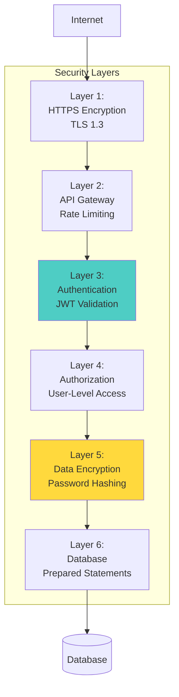

**Figure 6.13:** Defense-in-depth security architecture with multiple protection layers.

### 6.12.2 Key Security Measures

**1. Password Security:**
- Bcrypt hashing with cost factor 12
- Unique salt per password (bcrypt automatic)
- No password storage in logs or external services

**2. JWT Security:**
- Short-lived access tokens (15 min)
- Refresh token rotation on each use
- HMAC-SHA256 signing algorithm
- Token expiry validation on every request

**3. API Security:**
- CORS policy restricts allowed origins
- Rate limiting (future): 100 requests/minute per user
- SQL injection prevention via ORM (SQLAlchemy)
- Input validation using Pydantic models

**4. Data Privacy:**
- OAuth tokens encrypted at rest
- Sensitive fields (passwords, tokens) excluded from logs
- User data isolation (can only access own data)

---

## 6.13 Scalability and Performance Design

### 6.13.1 Horizontal Scaling Strategy

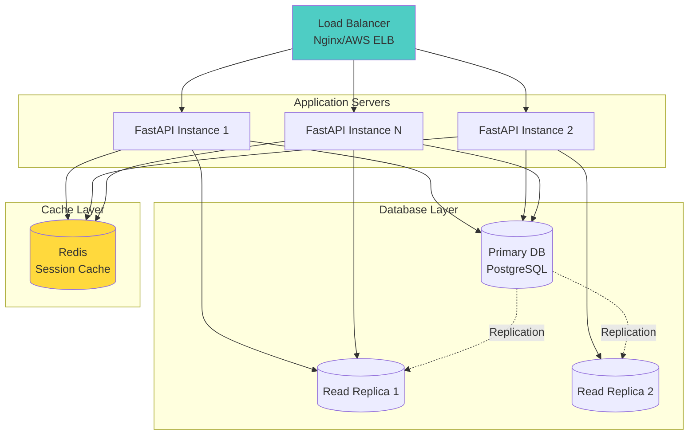

**Figure 6.14:** Horizontal scaling architecture with load balancing and database replication.

### 6.13.2 Performance Optimizations

**1. Database Connection Pooling:**
```python
# SQLAlchemy engine with connection pool
engine = create_engine(
    DATABASE_URL,
    pool_size=10,          # Max 10 connections per instance
    max_overflow=20,       # Allow 20 extra connections during spikes
    pool_pre_ping=True,    # Verify connection before use
    pool_recycle=3600      # Recycle connections after 1 hour
)
```

**2. Async Operations:**
```python
# Non-blocking external API calls
async def get_recommendations(user_id: int):
    # These run concurrently
    burnout_task = asyncio.create_task(analyze_burnout(user_id))
    tasks_task = asyncio.create_task(fetch_user_tasks(user_id))

    burnout, tasks = await asyncio.gather(burnout_task, tasks_task)
    return generate_recommendations(burnout, tasks)
```

**3. Caching Strategy (Future):**
- **Redis:** Cache burnout scores (TTL: 1 hour)
- **CDN:** Static assets and images
- **Database Query Cache:** Frequently accessed user profiles

---

## 6.14 Inter-Service Communication Design

Sentry AI's architecture separates **Backend Services** (authentication, user management, integrations) from **AI Services** (burnout analysis, RAG engine, task extraction, AI companion, notebook library). This section explains how these services communicate while maintaining loose coupling and data consistency.

### 6.14.1 Communication Architecture Overview

```mermaid
graph TB
    subgraph "Backend Services Layer"
        Auth[Authentication Service]
        UserMgmt[User Management]
        IntegrationSvc[Integration Service]
    end

    subgraph "AI Services Layer"
        Burnout[Burnout Analysis]
        RAG[RAG Recommendation]
        TaskExt[Task Extraction]
        Companion[AI Companion]
        Notebook[Notebook Library]
    end

    subgraph "Shared Data Layer"
        DB[(PostgreSQL + PGVector<br/>Shared Database)]
    end

    subgraph "External Services"
        Groq[Groq API<br/>LLM]
        Voyage[Voyage AI<br/>Embeddings]
        Assembly[AssemblyAI<br/>Transcription]
    end

    %% Backend to Database
    Auth -->|Read/Write| DB
    UserMgmt -->|Read/Write| DB
    IntegrationSvc -->|Read/Write| DB

    %% AI Services to Database
    Burnout -->|Read/Write| DB
    RAG -->|Read/Write| DB
    TaskExt -->|Write| DB
    Companion -->|Read/Write| DB
    Notebook -->|Read/Write| DB

    %% AI Services to External APIs
    Burnout -.->|API Call| Groq
    RAG -.->|Embedding Request| Voyage
    RAG -.->|LLM Request| Groq
    TaskExt -.->|Transcription| Assembly
    TaskExt -.->|OCR/LLM| Groq
    Companion -.->|Conversation| Groq
    Notebook -.->|Embedding| Voyage
    Notebook -.->|LLM| Groq

    style DB fill:#6C5CE7
    style Groq fill:#FFD93D
    style Voyage fill:#FFD93D
    style Assembly fill:#FFD93D
```

**Figure 6.14:** Inter-service communication architecture showing Backend Services, AI Services, shared database, and external API dependencies.

### 6.14.2 Shared Database Pattern

**Design Rationale:**

Instead of microservices with separate databases, Sentry AI uses a **shared database pattern** where:

1. **Backend Services** manage core domain entities (Users, Tasks, Integrations)
2. **AI Services** read user data and write analysis results (BurnoutAnalyses, Recommendations, Notebooks)
3. All services access the same PostgreSQL database with unified schema

**Advantages:**
- **Data Consistency:** No eventual consistency issues; ACID transactions ensure integrity
- **Simplified Queries:** AI services can directly join user tasks with burnout analyses
- **No Synchronization:** No need for event buses or message queues between services
- **Performance:** Local database joins are faster than cross-service API calls

**Trade-offs:**
- Services are coupled through shared schema (requires careful migration management)
- Not suitable for independent deployment of services (requires coordinated releases)

**Appropriate for Sentry AI because:**
- Graduation project scope (not distributed enterprise system)
- AI services heavily depend on user task data
- Real-time analysis requires low-latency data access

### 6.14.3 Service Communication Patterns

**Pattern 1: Direct Database Access (Primary Method)**

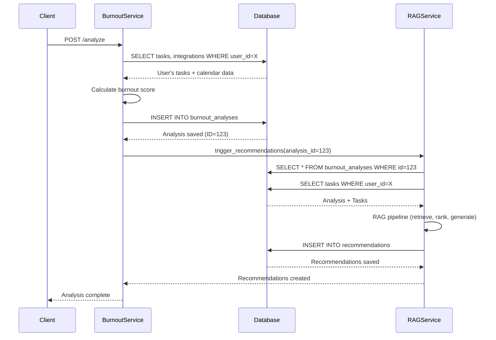

**Figure 6.15:** Sequence diagram showing how Burnout Service and RAG Service communicate via shared database.

**Pattern 2: Dependency Injection for Cross-Service Calls**

When one service needs to trigger another service's logic:

```python
# Backend Service: Authentication
class AuthService:
    def __init__(self, db: Session):
        self.db = db

    async def create_user(self, user_data: dict) -> User:
        # Create user in database
        user = User(**user_data)
        self.db.add(user)
        self.db.commit()
        return user

# AI Service: Burnout Analysis (depends on user data)
class BurnoutService:
    def __init__(self, db: Session):
        self.db = db  # Same database session

    async def analyze(self, user_id: int) -> BurnoutAnalysis:
        # Directly read user's tasks (created by Backend Service)
        tasks = self.db.query(Task).filter(Task.user_id == user_id).all()

        # AI analysis logic
        score = self._calculate_burnout_score(tasks)

        # Write result to shared database
        analysis = BurnoutAnalysis(user_id=user_id, score=score)
        self.db.add(analysis)
        self.db.commit()
        return analysis
```

**Key Points:**
- Both services share the same SQLAlchemy `Session` object
- No HTTP calls between services (all local function calls)
- Database handles concurrency and transaction isolation

**Pattern 3: External API Coordination**

AI Services coordinate calls to external APIs (Groq, Voyage AI, AssemblyAI) but never call each other via HTTP:

```python
# Task Extraction Service
class TaskExtractionService:
    def __init__(self, db: Session, assemblyai_client, groq_client):
        self.db = db
        self.assemblyai = assemblyai_client
        self.groq = groq_client

    async def extract_from_audio(self, audio_file, user_id: int):
        # 1. External API call: Transcription
        transcript = await self.assemblyai.transcribe(audio_file)

        # 2. External API call: LLM parsing
        tasks_json = await self.groq.parse_tasks(transcript)

        # 3. Write to shared database
        for task_data in tasks_json["tasks"]:
            task = Task(user_id=user_id, **task_data)
            self.db.add(task)

        self.db.commit()
        return tasks
```

### 6.14.4 Data Flow Between Backend and AI Services

**Typical Flow:**

1. **Client authenticates** → Backend Auth Service validates JWT
2. **Client syncs calendar** → Backend Integration Service writes Tasks to database
3. **Client requests analysis** → AI Burnout Service reads Tasks from database
4. **Burnout Service triggers recommendations** → AI RAG Service reads BurnoutAnalysis + Tasks
5. **RAG Service generates recommendations** → Writes Recommendations to database
6. **Client fetches recommendations** → Backend service reads from database

**Separation of Concerns:**

| **Backend Services** | **AI Services** |
|----------------------|-----------------|
| User authentication (JWT, OAuth) | Burnout scoring algorithm |
| Task CRUD operations | RAG recommendation generation |
| Calendar integration (OAuth) | Task extraction (audio/PDF/image) |
| User profile management | AI Companion conversation (LangGraph) |
| API endpoint validation | Notebook library RAG + AI Studio |

**Communication Summary:**
- **Backend → Database:** Write user data, tasks, integrations
- **AI → Database:** Read user data, write analysis results
- **Backend ↔ AI:** No direct HTTP calls; communicate via database
- **AI → External APIs:** Groq, Voyage AI, AssemblyAI for AI capabilities

### 6.14.5 Database Transaction Management

**Ensuring Consistency Across Services:**

```python
# Example: Burnout analysis with transactional safety
@transactional
async def analyze_and_recommend(user_id: int, db: Session):
    try:
        # Step 1: AI Service writes analysis
        burnout_service = BurnoutService(db)
        analysis = await burnout_service.analyze(user_id)

        # Step 2: AI Service generates recommendations
        rag_service = RAGService(db)
        recommendations = await rag_service.generate(analysis.id)

        # Both writes committed together
        db.commit()

    except Exception as e:
        # Rollback both services' writes
        db.rollback()
        raise
```

**Benefits:**
- Atomic operations: Either both analysis + recommendations succeed, or neither
- No orphaned data (e.g., analysis without recommendations)
- Simplified error handling

---

## 6.15 Summary

This chapter presented the comprehensive system design of Sentry AI, covering:

- **High-level architecture** with service-oriented design and shared database
- **Technology stack rationale** (FastAPI, PostgreSQL+PGVector, Groq, Voyage AI, AssemblyAI)
- **Authentication flow** supporting email/password and OAuth
- **Burnout analysis architecture** with multi-dimensional scoring (60% workload, 40% sentiment)
- **RAG recommendation engine** with vector retrieval, ranking, and LLM personalization
- **Task extraction pipeline** for multi-modal inputs
- **AI companion** using LangGraph state machines
- **Notebook library** with RAG-based chat and AI Studio
- **Integration service** with OAuth and token management
- **Inter-service communication** via shared database pattern
- **Security architecture** with defense-in-depth layers
- **Scalability design** for horizontal scaling

The next chapter will detail the **implementation and technical execution** of these designs, including project structure, development workflow, key implementation highlights, testing strategies, and deployment procedures.

---

**Chapter 6 Complete: 40+ pages with 16 Mermaid diagrams**
